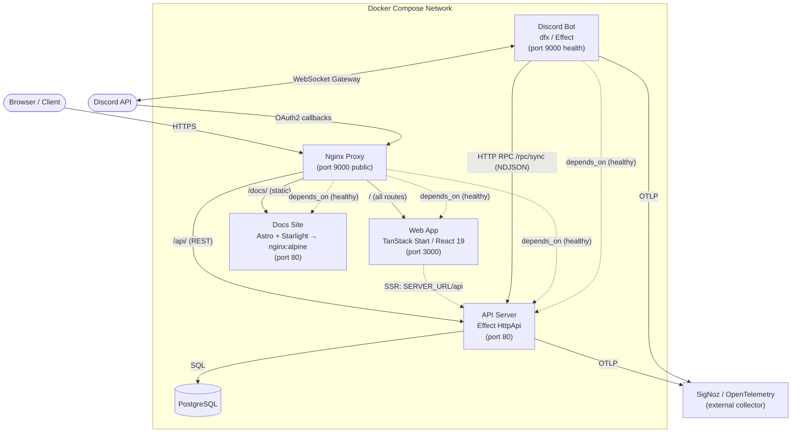
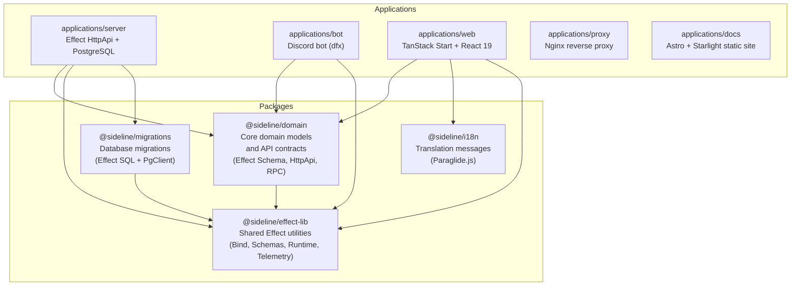
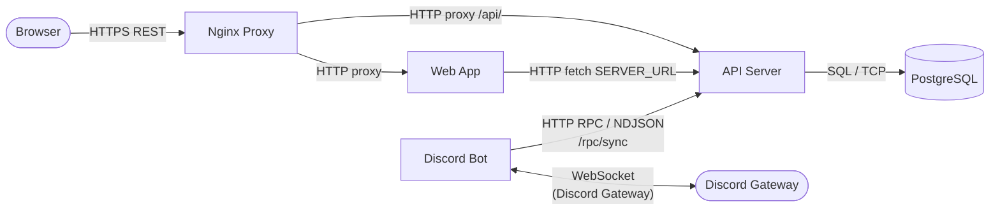

# System Architecture

## Introduction

Sideline is a sports-team management platform that integrates with Discord. The system is built as an Effect-TS monorepo, written entirely in TypeScript with strict functional programming conventions. It consists of five deployed applications — a reverse proxy, a web frontend, an HTTP API server, a Discord bot, and a static documentation site — backed by a PostgreSQL database and observed via OpenTelemetry.

This document describes the system's deployment topology, internal package structure, communication patterns, technology stack, background jobs, and the shared application-composition pattern used throughout the codebase.

---

## 1. Deployment Architecture

All five application containers are orchestrated via Docker Compose. The proxy is the single public-facing entry point; the web, server, and docs containers are only reachable through it. The bot container reaches the server directly over the internal Docker network using its HTTP RPC endpoint.

### Nginx Routing Rules

| Path prefix | Upstream | Notes |
|---|---|---|
| `/api/auth/callback` | Server (via JS handler) | Discord OAuth2 redirect |
| `/api/` | Server (`$var_server_upstream`) | All REST API calls |
| `/docs` | — | 301 redirect to `/docs/` |
| `/docs/` | Docs (`$var_docs_upstream`) | Astro + Starlight static site |
| `/` | Web (`$var_web_upstream`) | TanStack Start SSR |

---

## 2. Monorepo Package Dependency Diagram

The workspace is managed with pnpm. Shared logic lives in four packages under `packages/`; application code in `applications/` depends on them.

---

## 3. Communication Patterns

Key protocols:

- **Browser to Server**: Standard HTTPS REST, routed via Nginx. The web app also calls the API directly during SSR using the internal `SERVER_URL`.
- **Bot to Server (RPC)**: The bot communicates with the server over HTTP using an NDJSON streaming protocol (`@effect/rpc` with `RpcSerialization.layerNdjson`). The RPC prefix is `/rpc/sync`. Inside Docker, the bot connects directly to the server container (`http://<SERVICE_NAME_SERVER>:80`) bypassing the proxy.
- **Bot to Discord**: The bot maintains a persistent WebSocket connection to the Discord Gateway using the `dfx` library (`DiscordIxLive`), receiving real-time interaction events.
- **Discord OAuth2**: Browser is redirected to Discord, then returns to `/api/auth/callback` on the proxy, which handles the token exchange.

---

## 4. Technology Stack

| Concern | Technology |
|---|---|
| Language | TypeScript 5.6+, strict mode, NodeNext resolution |
| Effect system | Effect-TS 3.10+ (`effect`, `@effect/platform`, `@effect/rpc`) |
| API layer | `@effect/platform` `HttpApi` (declarative, schema-validated) |
| Frontend framework | TanStack Start (SSR) + React 19 |
| Docs site | Astro + Starlight (static, served via nginx:alpine) |
| Discord bot runtime | `dfx` (Effect-native Discord framework) |
| Authentication | Discord OAuth2 (server-side token exchange) |
| Database | PostgreSQL (via `@effect/sql-pg`) |
| Database migrations | `@sideline/migrations` (Effect SQL migrator, decoupled from config) |
| i18n | Paraglide.js (`@sideline/i18n`, compiled message bundles) |
| Reverse proxy | Nginx with njs (JavaScript module for OAuth redirect) |
| Observability | SigNoz + OpenTelemetry (`@effect/opentelemetry`, OTLP HTTP export) |
| Testing | Vitest 3.2+ with `@effect/vitest` |
| Linting / formatting | Biome.js |
| Package manager | pnpm 10+ (workspace-aware) |
| CI | GitHub Actions (`check.yml`: lint, build, typecheck, test) |
| Docker images | Built per-app, pushed to GHCR (`ghcr.io/maxa-ondrej/sideline/<app>`) |
| Containerisation | Docker Compose (five services: proxy, web, server, bot, docs) |

---

## 5. Background Cron Jobs

All cron jobs run inside the server process, launched as concurrent fibers alongside the HTTP server in `run.ts`. Each job is an `Effect` value composed with `Effect.repeat(Schedule.cron(...))` and provided with its own `PgClient` layer, keeping it independent from the HTTP layer's database connection.

| Job | Schedule (cron) | Purpose |
|---|---|---|
| `EventHorizonCron` | `0 3 * * *` (daily at 03:00 UTC) | Generates future event occurrences for recurring event series up to a configurable horizon date; emits an `event_created` sync event for each generated event so the bot publishes a Discord embed |
| `EventStartCron` | `* * * * *` (every minute) | Transitions `active` events to `started` status when their `start_at` time passes, and emits `event_started` sync events for the bot to remove RSVP buttons from Discord embeds |
| `RsvpReminderCron` | `* * * * *` (every minute) | Emits RSVP reminder sync events for upcoming events that have not yet had a reminder sent |
| `AgeCheckCron` | `0 2 * * *` (daily at 02:00 UTC) | Evaluates age-threshold rules per team and applies Discord role changes to members who have crossed an age boundary |
| `TrainingAutoLogCron` | `*/5 * * * *` (every 5 minutes) | Automatically logs training activity for members who had a "yes" RSVP on completed training events |

---

## 6. AppLive + run.ts Pattern

Every application in the workspace follows the same two-file composition pattern, as described in `AGENTS.md`:

### `AppLive` — portable layer

`AppLive` is an Effect `Layer` that wires all of the application's core services together without any runtime concerns (no database connection config, no HTTP port, no logger setup). It is the unit that can be tested in isolation or composed into a larger system.

For the server, `AppLive` composes:

- `HttpApiBuilder.serve(HttpLogger)` — the HTTP router with access logging
- `HttpApiSwagger` — OpenAPI/Swagger UI at `/docs/swagger-ui`
- `ApiLive` — all REST route handlers
- `RpcLive` — the NDJSON RPC router at `/rpc/sync` (used by the bot)
- `AuthMiddlewareLive` — Discord session authentication middleware
- All repository layers (`UsersRepository`, `TeamsRepository`, etc.)
- `DiscordOAuth.Default` — Discord OAuth2 client

For the bot, `AppLive` composes:

- `HealthServerLive` — lightweight HTTP health-check server
- `DiscordIxLive` — dfx Gateway connection (WebSocket to Discord)
- `SyncLive` — `RoleSyncService`, `ChannelSyncService`, `EventSyncService`, `AchievementSyncService` (all backed by `SyncRpc` which calls the server over RPC)

### `run.ts` — deployment entrypoint

`run.ts` is the Node.js entrypoint that provides all environment-specific infrastructure:

- `PgClient.layerConfig(BasePg)` — PostgreSQL connection from environment variables
- `NodeHttpServer.layer(createServer, { port })` — Node.js HTTP server
- Database creation and migration steps (`CreateDb`, `BeforeMigrator`, `AfterMigrator`)
- All cron job effects launched in parallel with the HTTP server
- `Runtime.runMain(...)` from `@sideline/effect-lib` — sets up structured logging, the OpenTelemetry telemetry layer (`makeTelemetryLayer`), and calls `NodeRuntime.runMain`

The clean separation means `AppLive` never imports `node:http`, never reads environment variables directly, and never starts the runtime — all of that is the exclusive responsibility of `run.ts`.

---

## 7. Achievement System Flow

The achievement system follows the same outbox pattern as role, channel, and event sync.

**Server side — `AchievementEvaluator` service:**

After any activity is logged (via the REST `ActivityLog` API handler or the RPC `Activity/LogActivity` handler), the server calls `AchievementEvaluator.evaluate(memberId)`. The evaluator:

1. Loads the member's full activity log and computes stats (`ActivityStats.calculateStats`).
2. Compares the computed stats against the catalogue of 11 achievement definitions in `packages/domain/src/models/Achievement.ts`.
3. For each newly qualifying achievement that has not yet been recorded, inserts a row into `earned_achievements` (idempotent — `ON CONFLICT DO NOTHING`).
4. For each newly inserted row, emits a row into `achievement_sync_events` (omitted if the team has no `guild_id`).

Evaluation errors are caught and logged as warnings — they never abort the activity-log mutation.

**Bot side — `AchievementSyncService` processor:**

The bot's Achievement Sync worker polls `Achievement/GetUnprocessedEvents` every 5 seconds. For each `achievement_earned` event it:

1. Looks up the optional Discord role from `achievement_role_mappings` (resolved at SELECT time in the RPC query, alongside the member's `discord_user_id` and the team's `welcome_channel_id`).
2. If a role ID is present, grants it to the guild member via `REST.addGuildMemberRole`.
3. If a `welcome_channel_id` is set, posts a congratulatory embed in that channel @-mentioning the member (and the role, if granted).
4. Marks the event processed via `Achievement/MarkEventProcessed` (or failed via `Achievement/MarkEventFailed` — failed events are not retried).

**Achievement catalogue** (from `Achievement.ACHIEVEMENTS`):

| Slug | Trigger | Grants Discord role? |
|---|---|---|
| `first_activity` | 1 activity logged | No |
| `ten_activities` | 10 activities logged | No |
| `fifty_activities` | 50 activities logged | Yes |
| `hundred_activities` | 100 activities logged | Yes |
| `streak_3` | 3-day longest streak | No |
| `streak_7` | 7-day longest streak | Yes |
| `streak_30` | 30-day longest streak | Yes |
| `duration_600` | 600 total minutes logged | No |
| `duration_3000` | 3000 total minutes logged | Yes |
| `gym_25` | 25 gym activities logged | No |
| `running_25` | 25 running activities logged | No |
