# Entity-Relationship Diagram

## Introduction

The Sideline database is implemented in PostgreSQL and follows a consistent set of design conventions across all tables. Every entity uses a UUID primary key generated by `gen_random_uuid()`, which avoids sequential ID enumeration and supports distributed generation without coordination. Timestamps are stored as `TIMESTAMPTZ` to preserve time-zone awareness. Foreign-key constraints use `ON DELETE CASCADE` where child records are meaningless without the parent (e.g. team members when a team is deleted), and `ON DELETE RESTRICT` or `ON DELETE SET NULL` in cases where the child record should be preserved or the reference simply cleared. The schema evolved incrementally through a sequence of numbered migration files; the final column set for each table reflects the cumulative result of all applied migrations.

The database is organised into fourteen functional domains: authentication and user identity, teams and membership (including onboarding tokens), roles and permissions, groups (hierarchical sub-divisions of a team), training types, events and RSVP tracking, Discord bot integration, activity logging and achievements, weekly activity summaries, calendar token management, in-app notifications, finance (fee management, payment tracking, payment reminders, and expense tracking), and weekly challenges. The following diagrams capture the relationships within and between these domains.

---

## Overview Diagram

The overview diagram omits column details and shows only entity names and their relationships, giving a high-level map of the entire schema.

```mermaid
erDiagram
    users ||--o{ sessions : "has"
    users ||--o{ oauth_connections : "authenticates via"
    users ||--o{ ical_tokens : "owns"
    users ||--o{ team_members : "joins as"
    users ||--o{ team_invites : "creates"
    users ||--o{ invite_acceptances : "generates"
    users ||--o{ teams : "founds"
    users ||--o{ pending_teams : "founded"
    users ||--o{ notifications : "receives"
    users ||--o{ team_onboarding_tokens : "completes"

    teams ||--o{ team_members : "has"
    teams ||--o{ team_invites : "issues"
    teams ||--|{ team_settings : "configures"
    teams ||--o{ roles : "defines"
    teams ||--o{ groups : "organises"
    teams ||--o{ training_types : "classifies"
    teams ||--o{ events : "schedules"
    teams ||--o{ event_series : "schedules"
    teams ||--o{ notifications : "scopes"
    teams ||--o{ discord_role_mappings : "maps"
    teams ||--o{ discord_channel_mappings : "maps"
    teams ||--o{ role_sync_events : "logs"
    teams ||--o{ channel_sync_events : "logs"
    teams ||--o{ event_sync_events : "logs"
    teams ||--o{ age_threshold_rules : "configures"
    teams ||--o{ activity_types : "extends"
    teams ||--o{ rosters : "manages"
    teams ||--o{ achievement_role_mappings : "configures"
    teams ||--o{ achievement_sync_events : "logs"
    teams ||--o{ achievement_settings : "overrides"
    teams ||--o{ custom_achievements : "defines"
    teams ||--o{ discord_role_provision_events : "queues"
    teams ||--o{ weekly_summary_sync_events : "queues"
    teams ||--o{ fees : "defines"
    teams ||--o{ expenses : "incurs"
    teams ||--o{ team_onboarding_tokens : "created for"
    teams ||--o{ weekly_challenges : "sets"
    weekly_challenges ||--o{ weekly_challenge_completions : "completed via"
    weekly_challenges ||--o{ weekly_challenge_sync_events : "queues"
    team_members ||--o{ weekly_challenge_completions : "marks"

    bot_guilds ||--o{ discord_channels : "hosts"

    team_members ||--o{ member_roles : "holds"
    team_members ||--o{ group_members : "belongs to"
    team_members ||--o{ event_rsvps : "submits"
    team_members ||--o{ activity_logs : "records"
    team_members ||--o{ roster_members : "appears on"
    team_members ||--o{ events : "creates"
    team_members ||--o{ event_series : "creates"
    team_members o|--o{ events : "claims"
    team_members ||--o{ earned_achievements : "earns"
    team_members ||--o{ achievement_sync_events : "triggers"

    roles ||--o{ role_permissions : "grants"
    roles ||--o{ member_roles : "assigned via"
    roles ||--o{ discord_role_mappings : "linked via"
    roles ||--o{ role_training_types : "accesses"
    roles ||--o{ role_groups : "assigned to"

    groups ||--o{ group_members : "contains"
    groups ||--o{ age_threshold_rules : "triggers"
    groups o|--o{ age_threshold_rules : "requires"
    groups ||--o{ discord_channel_mappings : "linked via"
    groups ||--o{ role_groups : "receives"
    groups ||--o{ training_types : "owns"
    groups ||--o{ events : "scopes"
    groups ||--o{ event_series : "scopes"
    groups o|--o{ groups : "parent of"
    groups o|--o{ team_invites : "targeted by"

    training_types ||--o{ role_training_types : "available to"
    training_types ||--o{ events : "classifies"
    training_types ||--o{ event_series : "classifies"

    event_series ||--o{ events : "generates"

    events ||--o{ event_rsvps : "collects"
    events ||--o{ event_sync_events : "triggers"

    activity_types ||--o{ activity_logs : "categorises"

    rosters ||--o{ roster_members : "contains"

    team_invites ||--o{ invite_acceptances : "tracks"

    fees ||--o{ fee_assignments : "assigned via"
    fee_assignments ||--o{ payments : "settled by"
    fee_assignments ||--o{ payment_reminder_sync_events : "queues"
    fee_assignments ||--o{ payment_reminders_sent : "tracks"
    team_members ||--o{ fee_assignments : "owes"
    team_members ||--o{ payments : "makes"
    users ||--o{ payments : "records"
    users ||--o{ expenses : "creates"
    users ||--o{ expense_history : "performs"
    expenses ||--o{ expense_history : "journalled in"

    weekly_challenges ||--o{ weekly_challenge_completions : "completed via"
    weekly_challenges ||--o{ weekly_challenge_sync_events : "queues"
    team_members ||--o{ weekly_challenge_completions : "marks"
```

---

## Detailed Sub-Diagrams

### Auth & Users

The `users` table is the central identity record created during Discord OAuth. Tokens are separated into `oauth_connections` to allow future providers. `sessions` are short-lived server-side tokens; `ical_tokens` are long-lived per-user secrets used to serve private calendar feeds.

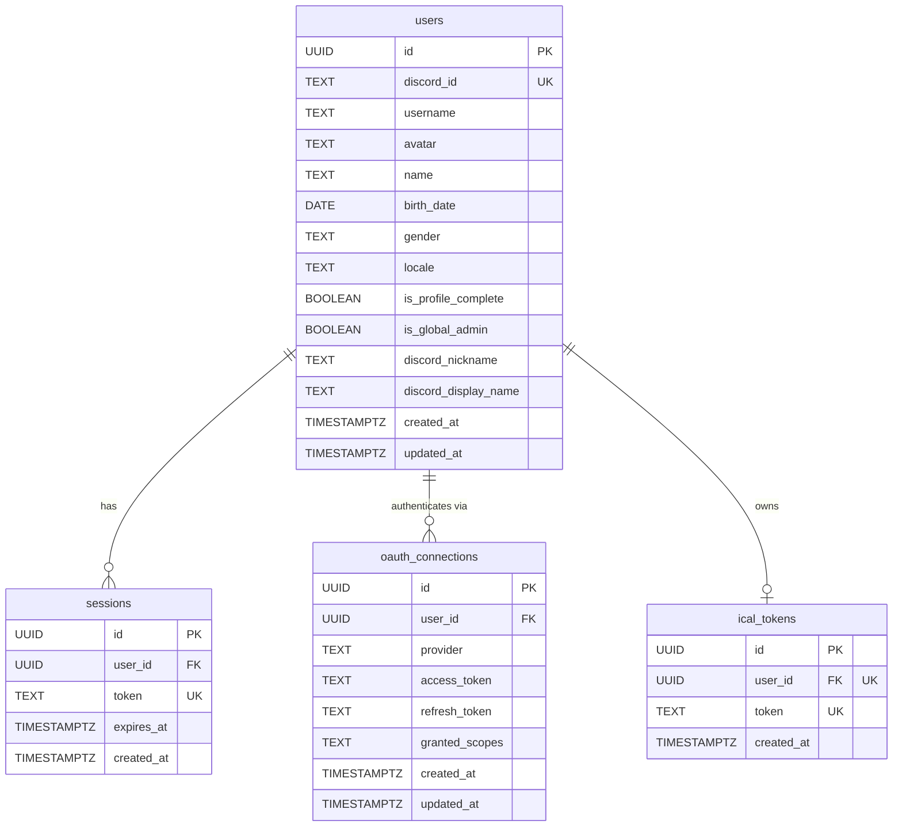

---

### Teams & Members

`teams` are the top-level organisational unit, each tied to a single Discord guild. `team_members` is the join table between a user and a team, carrying the membership state (active flag, jersey number). `team_invites` hold short-lived invite codes. `team_settings` is a one-to-one extension of `teams` holding configurable defaults. `pending_teams` is an archive table for teams that were created before guild linking was enforced.

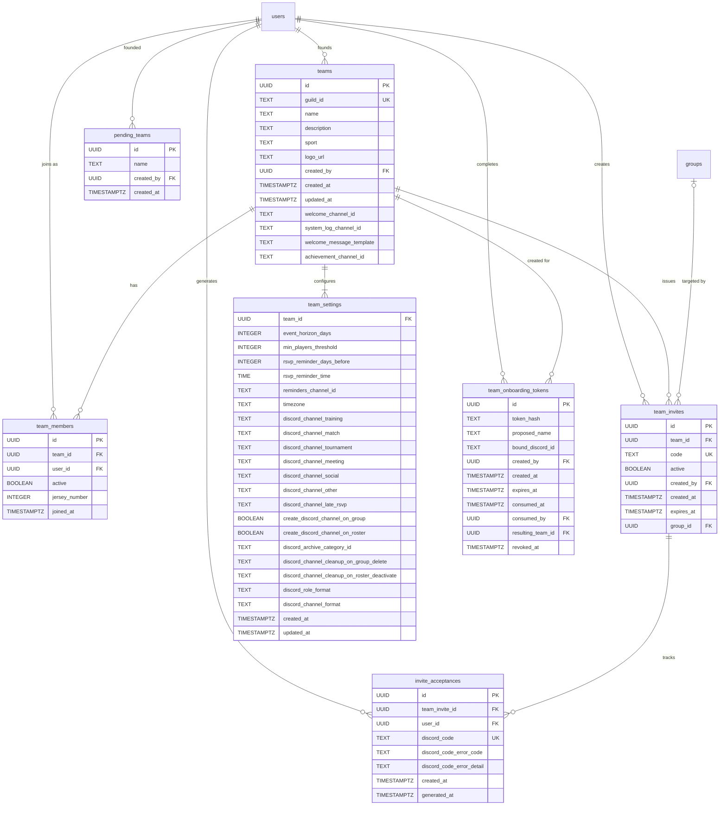

---

### Roles & Permissions

Every team defines a set of roles. Built-in roles (Admin, Captain, Player, Treasurer) are seeded automatically. `role_permissions` stores the individual permission strings granted to a role. `member_roles` is the many-to-many junction associating team members with roles.

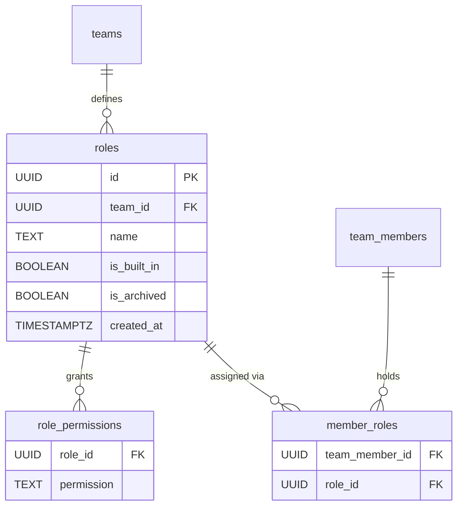

---

### Groups

`groups` are hierarchical sub-divisions of a team (e.g. age brackets, skill tiers). They support self-referential parent/child nesting via `parent_id`. `group_members` links team members to groups. `age_threshold_rules` define automatic group assignment criteria (age range, gender, required pre-existing group membership, or any combination); all criteria on a rule must match simultaneously (AND semantics). `role_groups` associates roles with groups, restricting which roles are visible or applicable within a group context.

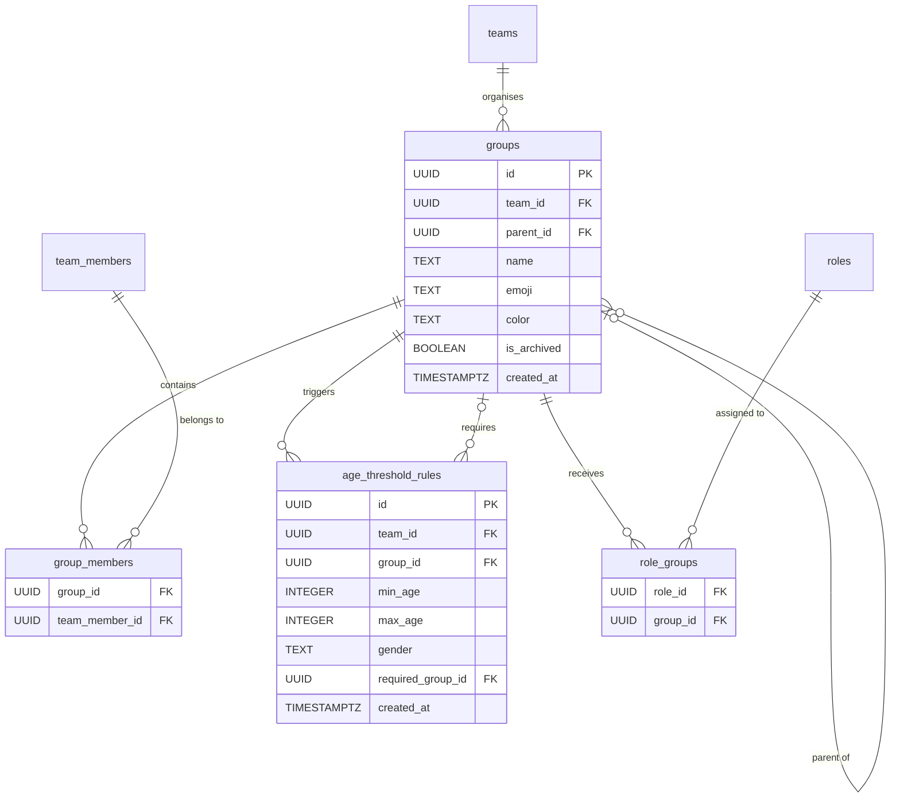

---

### Training Types

`training_types` categorise team activities (e.g. strength, tactical). Each type optionally belongs to an owner group and may restrict member visibility to another group. `role_training_types` controls which roles have access to a training type.

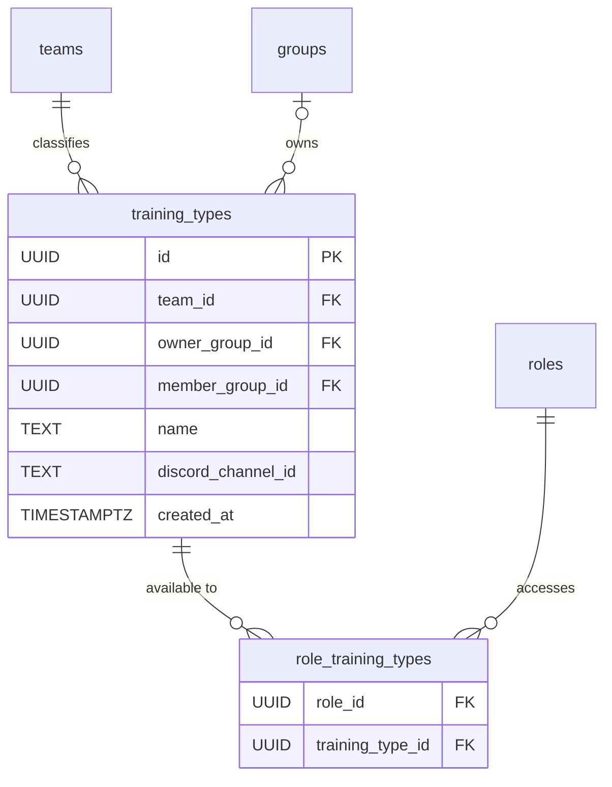

---

### Events

`events` are individual scheduled occurrences. `event_series` are recurring schedules that generate individual event rows on a rolling horizon. `event_rsvps` capture each team member's attendance response for a given event.

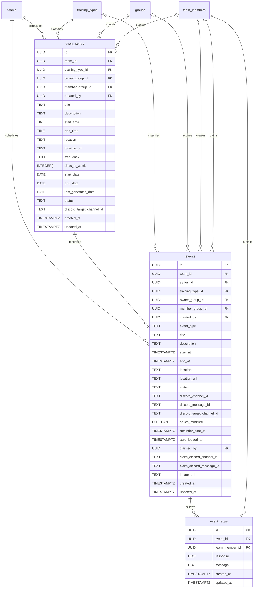

---

### Discord Integration

This domain bridges the application to a Discord bot. `bot_guilds` tracks which Discord servers the bot has joined. `discord_channels` caches the channel list for each guild. `discord_role_mappings` and `discord_channel_mappings` link application roles and groups to their Discord counterparts. In `discord_channel_mappings`, the `discord_channel_id` column is nullable — a group always receives a Discord role, but a Discord channel is only created when explicitly requested (via the `create_discord_channel_on_group` team setting or a manual "Create channel" action). The three sync-event tables (`role_sync_events`, `channel_sync_events`, `event_sync_events`) are outbox tables consumed by the bot worker to propagate state changes to Discord. `channel_event_dividers` tracks the single divider message posted in each event channel to visually separate past events from upcoming ones.

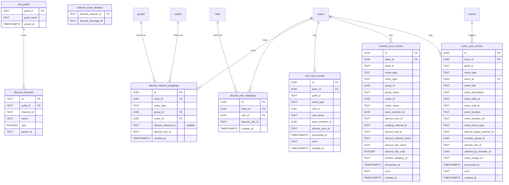

---

### Activity Tracking & Achievements

`activity_logs` record individual physical activity sessions for a team member. `activity_types` defines the catalogue of activity kinds — four global built-in slugs (gym, running, stretching, training) plus optional team-specific custom types created by team admins. Each type carries an optional single-grapheme emoji and a short description. `earned_achievements` record milestones unlocked by a member (e.g. first activity, 7-day streak). `achievement_role_mappings` optionally tie each achievement to a Discord role that is granted when the achievement is earned. `achievement_sync_events` is the outbox table the bot drains to grant Discord roles and post congratulatory embeds. `achievement_settings` stores per-team threshold overrides for built-in achievements. `custom_achievements` holds team-defined achievements with fully configurable rules and thresholds. `discord_role_provision_events` is the outbox table the bot's Role Provision worker drains to auto-create Discord roles for achievements.

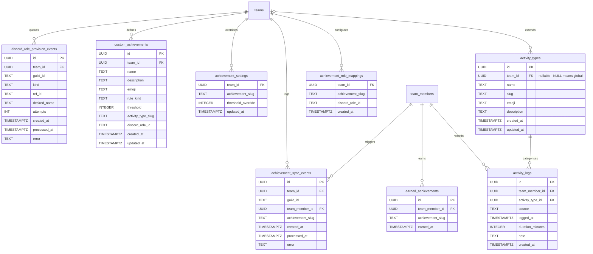

---

### Weekly Summary

`weekly_summary_sync_events` is the outbox table the bot's Weekly Summary worker drains each week. The `WeeklySummaryCron` inserts one row per team on Sunday at 20:00 local team time (for teams with a configured Discord channel). The bot builds the weekly embed from the encoded `payload` and posts it to `channel_id`, then marks the row delivered.

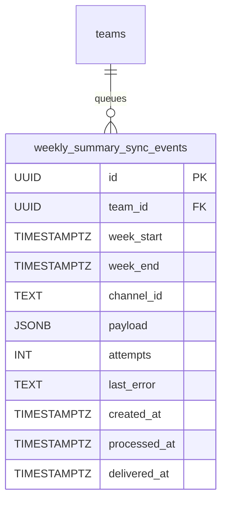

---

### Rosters

`rosters` are named lists of team members used for match-day squad selection. `roster_members` is the join table that adds a team member to a roster.

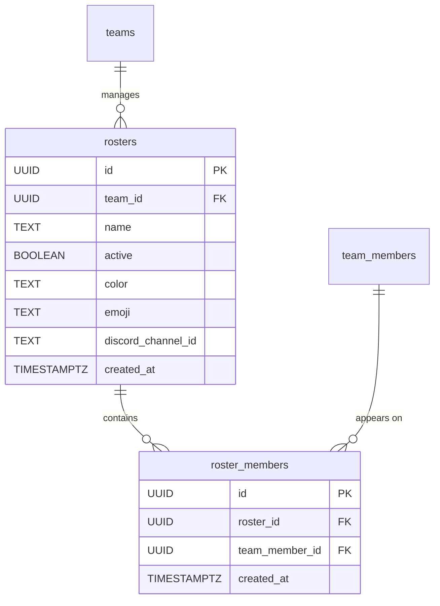

---

### Calendar

`ical_tokens` store per-user secret tokens that are embedded in a private iCal feed URL, allowing external calendar applications to subscribe to a user's team events without requiring authentication.

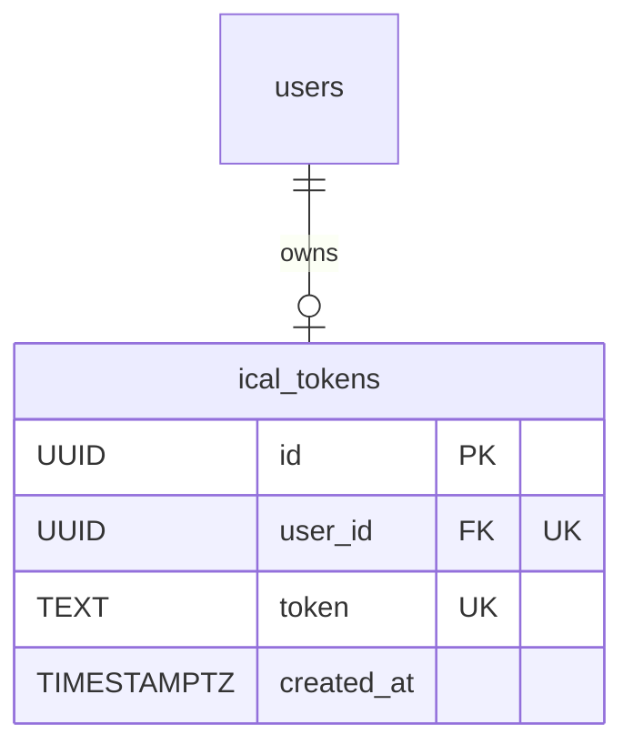

---

### Notifications

`notifications` are in-app alert records scoped to a specific team and user. The `is_read` flag drives unread badge counts; a partial index on `(user_id, is_read) WHERE is_read = false` makes unread queries efficient.

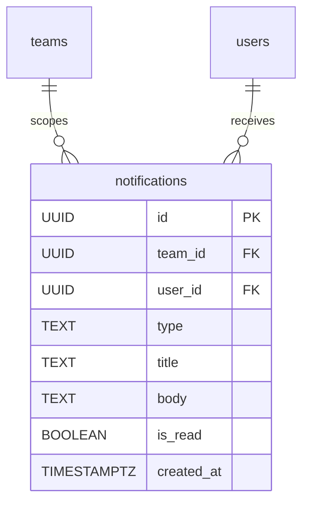

---

### Translation CMS

`translation_overrides` stores global admin-managed overrides for compiled UI strings. Each row replaces the compiled default for a specific key and locale combination. `translation_cache_version` holds a single row whose `version` counter is incremented by the application on every write (via `UPDATE … RETURNING version` and a `NOTIFY translation_cache_invalidate` call), allowing the server's in-process cache to refresh without polling.

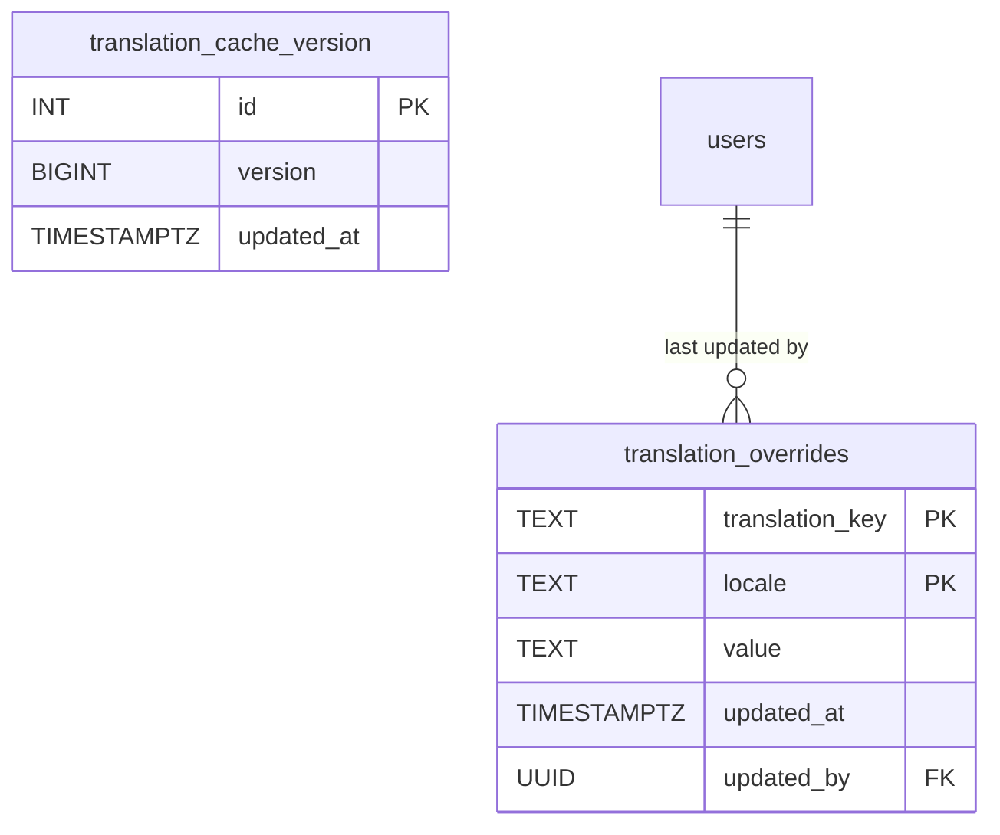

---

### Finance

The Finance subsystem tracks fee definitions, per-member assignments, payment records, and team expenditures. `paid_minor` on `fee_assignments` is kept current by a PostgreSQL trigger; the `fee_assignment_status_v` view computes the displayed status. Payment reminders are delivered via the `payment_reminder_sync_events` outbox (drained by the bot's Finance Sync worker) with `payment_reminders_sent` acting as an idempotency guard. Team expenditures are recorded in `expenses`; every insert, update, and delete is journalled into `expense_history` by the `expenses_audit` trigger.

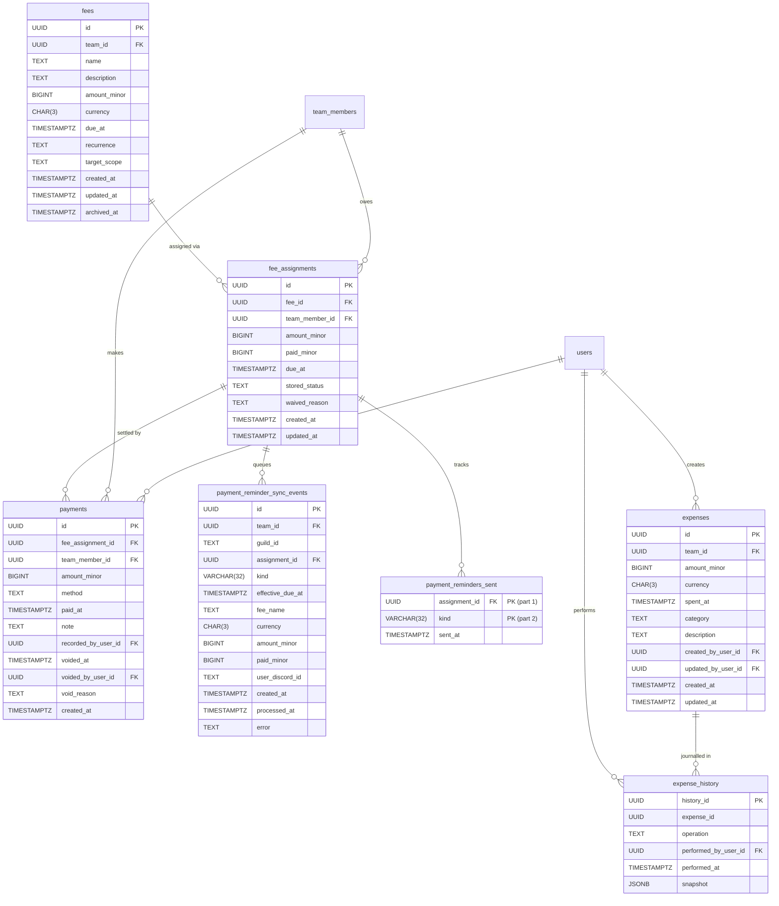

---

### Weekly Challenges

`weekly_challenges` represent team-scoped challenges issued for a specific week. Each challenge has a kind (`throwing` or `sport`), a title, and an optional description. `weekly_challenge_completions` is the junction table recording which team members have marked a challenge complete; the PK is `(challenge_id, member_id)` and both columns cascade on delete. `weekly_challenge_sync_events` is the outbox table consumed by the bot's Weekly Challenge Sync worker: one row is inserted per challenge at team-TZ 09:00 on the challenge's Monday so the bot can post the weekly embed without a cron.

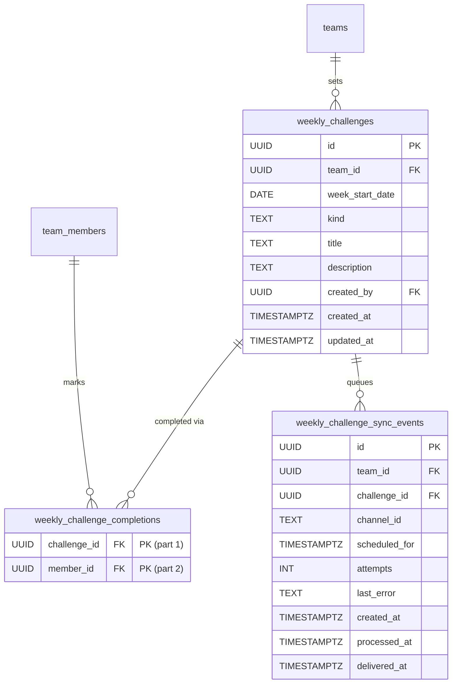

---

## Entity Summary

| Table | Description |
|---|---|
| `users` | Core identity record for every person who has signed in via Discord OAuth. |
| `sessions` | Short-lived server-side authentication tokens issued to logged-in users. |
| `oauth_connections` | OAuth access and refresh tokens per user per provider (currently Discord only). |
| `ical_tokens` | Long-lived secret token that enables unauthenticated iCal feed access per user. |
| `teams` | Top-level organisational unit tied one-to-one with a Discord guild. |
| `team_members` | Membership record joining a user to a team, carrying per-team profile data. |
| `team_invites` | Invite codes that allow new users to join a specific team, optionally pre-assigning them to a group. |
| `invite_acceptances` | One row per individual accept action; tracks the per-acceptance single-use Discord invite code generated by the bot. |
| `team_settings` | One-to-one extension of teams holding configurable operational defaults. |
| `pending_teams` | Archive of teams that existed before mandatory guild linking was enforced. |
| `team_onboarding_tokens` | Single-use tokens minted by global admins that allow a designated captain to complete the team setup wizard. Only the SHA-256 hash of the plaintext token is stored. Lifecycle state (`active`, `consumed`, `expired`, `revoked`) is derived from `consumed_at`, `revoked_at`, and `expires_at`. |
| `roles` | Named permission bundles defined per team; built-in roles are seeded automatically. |
| `role_permissions` | Individual permission strings granted to a role. |
| `member_roles` | Many-to-many junction assigning roles to team members. |
| `groups` | Hierarchical sub-divisions of a team (e.g. age brackets, skill tiers). |
| `group_members` | Many-to-many junction placing team members in groups. |
| `age_threshold_rules` | Rules that automatically assign members to a group based on automatic group criteria (age range, gender, required pre-existing group membership, or any combination). |
| `role_groups` | Many-to-many junction associating roles with groups. |
| `training_types` | Named categories for training activities, optionally restricted by group and role. |
| `role_training_types` | Many-to-many junction controlling which roles can access a training type. |
| `events` | Individual scheduled occurrences (training, match, tournament, etc.). |
| `event_series` | Recurring event schedules that generate individual event rows on a rolling horizon. |
| `event_rsvps` | Attendance responses (yes / no / maybe) submitted by team members for events. |
| `bot_guilds` | Registry of Discord servers where the Sideline bot is installed. |
| `discord_channels` | Cached channel list fetched from Discord for each bot guild. |
| `discord_role_mappings` | Links an application role to its corresponding Discord role. |
| `discord_channel_mappings` | Links an application group or roster to its corresponding Discord channel and/or role; the channel is optional (a mapping may be role-only). |
| `role_sync_events` | Outbox records driving role-assignment changes in Discord. |
| `channel_sync_events` | Outbox records driving channel-membership changes in Discord. |
| `event_sync_events` | Outbox records driving event announcements and updates in Discord. |
| `channel_event_dividers` | Tracks the divider message ID posted in each event channel to separate past from upcoming events. |
| `activity_types` | Catalogue of activity kinds; four global built-ins (gym, running, stretching, training) plus optional team-specific custom types. Each type carries an optional emoji and description. |
| `activity_logs` | Individual physical activity session records belonging to a team member. |
| `earned_achievements` | Records which achievements a team member has earned; each achievement is earned at most once per member. |
| `achievement_role_mappings` | Maps an achievement slug to the Discord role that should be granted when a team member earns it. |
| `achievement_sync_events` | Outbox records driving achievement Discord notifications (role grants and congratulatory embeds) in the bot. |
| `achievement_settings` | Per-team threshold overrides for built-in achievements; a row exists only when the team has changed a threshold from its default. |
| `custom_achievements` | Team-defined achievements with configurable names, descriptions, rule kinds, thresholds, and optional Discord role grants. |
| `discord_role_provision_events` | Outbox records for the bot's Role Provision worker to auto-create Discord roles for achievement mappings. |
| `weekly_summary_sync_events` | Outbox records for the bot's Weekly Summary worker to post the weekly activity digest embed to a configured Discord channel. |
| `rosters` | Named match-day squad lists managed per team. |
| `roster_members` | Many-to-many junction placing team members on a roster. |
| `notifications` | In-app alert records scoped to a team and user, with read/unread tracking. |
| `translation_overrides` | Global admin-managed overrides for compiled UI strings, keyed by translation key and locale. |
| `fees` | Fee definitions scoped to a team. Soft-deletable via `archived_at`. |
| `fee_assignments` | Per-member assignment of a fee, with optional amount and due date overrides. `paid_minor` is trigger-maintained. |
| `payment_reminder_sync_events` | Outbox records for the bot's Finance Sync worker to send payment reminder DMs. Each row carries a snapshot of the assignment at emission time. |
| `payment_reminders_sent` | Idempotency guard: one row per (assignment, kind) pair written only after the reminder DM was successfully delivered. Prevents duplicate reminders on retry. |
| `payments` | Individual payment records against a fee assignment. Voided (not deleted) when reversed. |
| `expenses` | Team expenditure records (pitch hire, travel, equipment, etc.). Hard-deleted; each write is journalled into `expense_history` by a Postgres trigger. |
| `expense_history` | Append-only audit log for `expenses`. One row per insert/update/delete, capturing the full row snapshot as JSONB. `expense_id` is stored without a FK so history is retained after the expense is deleted. |
| `translation_cache_version` | Single-row version counter incremented on every translation override write; used by the frontend for cache invalidation. |
| `weekly_challenges` | A team-scoped challenge issued for a specific ISO week (`week_start_date` = Monday). Kind is `throwing` or `sport`. Title max 120 chars; description max 2000 chars. Unique on `(team_id, week_start_date)`. |
| `weekly_challenge_completions` | Records which team members have completed a challenge for its week. Composite PK `(challenge_id, member_id)`; both columns cascade on delete. |
| `weekly_challenge_sync_events` | Outbox records for the bot's Weekly Challenge Sync worker to post the weekly embed to a configured Discord channel. Scheduled at team-TZ 09:00 on the challenge's Monday. |
