# Entity-Relationship Diagram

## Introduction

The Sideline database is implemented in PostgreSQL and follows a consistent set of design conventions across all tables. Every entity uses a UUID primary key generated by `gen_random_uuid()`, which avoids sequential ID enumeration and supports distributed generation without coordination. Timestamps are stored as `TIMESTAMPTZ` to preserve time-zone awareness. Foreign-key constraints use `ON DELETE CASCADE` where child records are meaningless without the parent (e.g. team members when a team is deleted), and `ON DELETE RESTRICT` or `ON DELETE SET NULL` in cases where the child record should be preserved or the reference simply cleared. The schema evolved incrementally through a sequence of numbered migration files; the final column set for each table reflects the cumulative result of all applied migrations.

The database is organised into nine functional domains: authentication and user identity, teams and membership, roles and permissions, groups (hierarchical sub-divisions of a team), training types, events and RSVP tracking, Discord bot integration, activity logging, calendar token management, and in-app notifications. The following diagrams capture the relationships within and between these domains.

---

## Overview Diagram

The overview diagram omits column details and shows only entity names and their relationships, giving a high-level map of the entire schema.

```mermaid
erDiagram
    users ||--o{ sessions : "has"
    users ||--o{ oauth_connections : "authenticates via"
    users ||--o{ ical_tokens : "owns"
    users ||--o{ team_members : "joins as"
    users ||--o{ team_invites : "creates"
    users ||--o{ teams : "founds"
    users ||--o{ pending_teams : "founded"
    users ||--o{ notifications : "receives"

    teams ||--o{ team_members : "has"
    teams ||--o{ team_invites : "issues"
    teams ||--|{ team_settings : "configures"
    teams ||--o{ roles : "defines"
    teams ||--o{ groups : "organises"
    teams ||--o{ training_types : "classifies"
    teams ||--o{ events : "schedules"
    teams ||--o{ event_series : "schedules"
    teams ||--o{ notifications : "scopes"
    teams ||--o{ discord_role_mappings : "maps"
    teams ||--o{ discord_channel_mappings : "maps"
    teams ||--o{ role_sync_events : "logs"
    teams ||--o{ channel_sync_events : "logs"
    teams ||--o{ event_sync_events : "logs"
    teams ||--o{ age_threshold_rules : "configures"
    teams ||--o{ activity_types : "extends"
    teams ||--o{ rosters : "manages"

    bot_guilds ||--o{ discord_channels : "hosts"

    team_members ||--o{ member_roles : "holds"
    team_members ||--o{ group_members : "belongs to"
    team_members ||--o{ event_rsvps : "submits"
    team_members ||--o{ activity_logs : "records"
    team_members ||--o{ roster_members : "appears on"
    team_members ||--o{ events : "creates"
    team_members ||--o{ event_series : "creates"
    team_members o|--o{ events : "claims"

    roles ||--o{ role_permissions : "grants"
    roles ||--o{ member_roles : "assigned via"
    roles ||--o{ discord_role_mappings : "linked via"
    roles ||--o{ role_training_types : "accesses"
    roles ||--o{ role_groups : "assigned to"

    groups ||--o{ group_members : "contains"
    groups ||--o{ age_threshold_rules : "triggers"
    groups ||--o{ discord_channel_mappings : "linked via"
    groups ||--o{ role_groups : "receives"
    groups ||--o{ training_types : "owns"
    groups ||--o{ events : "scopes"
    groups ||--o{ event_series : "scopes"
    groups o|--o{ groups : "parent of"
    groups o|--o{ team_invites : "targeted by"

    training_types ||--o{ role_training_types : "available to"
    training_types ||--o{ events : "classifies"
    training_types ||--o{ event_series : "classifies"

    event_series ||--o{ events : "generates"

    events ||--o{ event_rsvps : "collects"
    events ||--o{ event_sync_events : "triggers"

    activity_types ||--o{ activity_logs : "categorises"

    rosters ||--o{ roster_members : "contains"
```

---

## Detailed Sub-Diagrams

### Auth & Users

The `users` table is the central identity record created during Discord OAuth. Tokens are separated into `oauth_connections` to allow future providers. `sessions` are short-lived server-side tokens; `ical_tokens` are long-lived per-user secrets used to serve private calendar feeds.

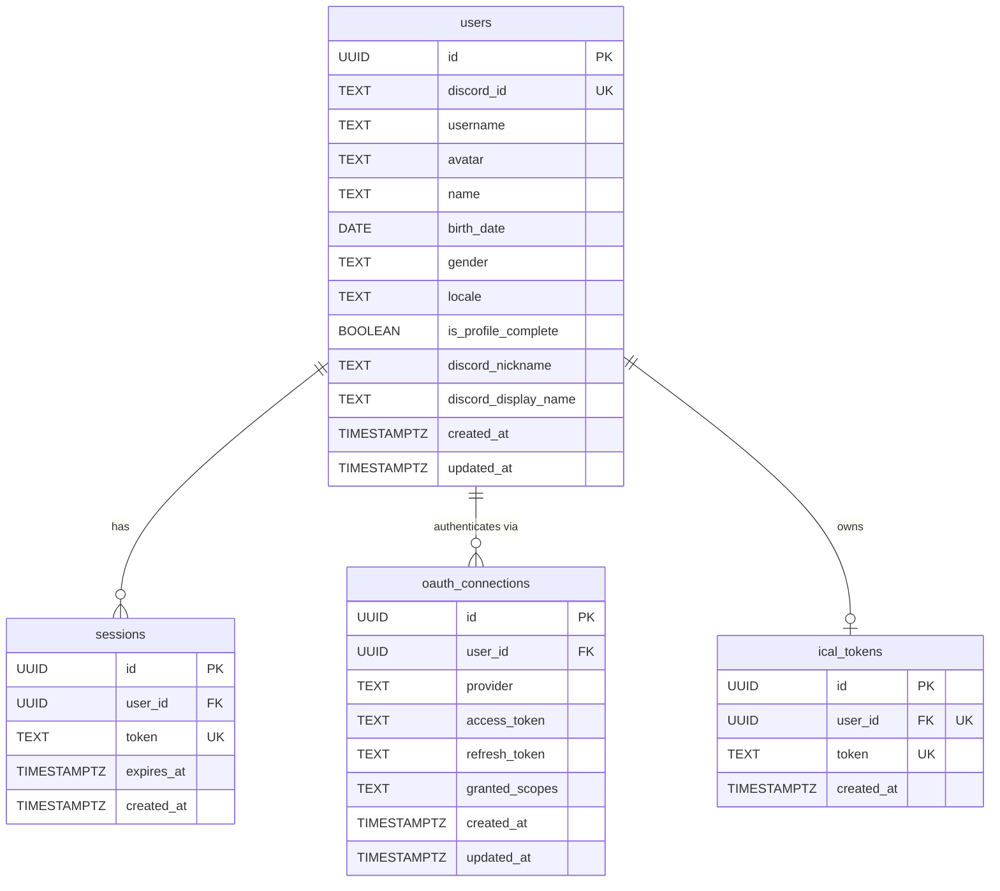

---

### Teams & Members

`teams` are the top-level organisational unit, each tied to a single Discord guild. `team_members` is the join table between a user and a team, carrying the membership state (active flag, jersey number). `team_invites` hold short-lived invite codes. `team_settings` is a one-to-one extension of `teams` holding configurable defaults. `pending_teams` is an archive table for teams that were created before guild linking was enforced.

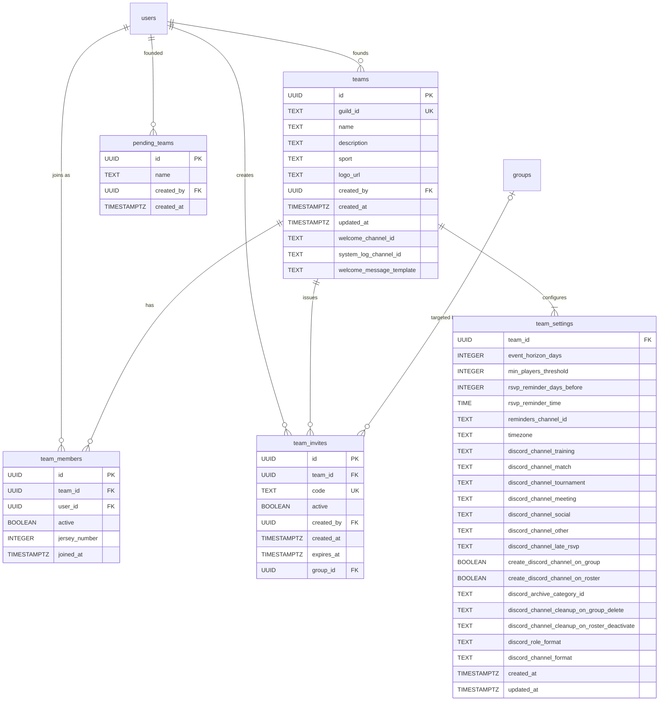

---

### Roles & Permissions

Every team defines a set of roles. Built-in roles (Admin, Captain, Player) are seeded automatically. `role_permissions` stores the individual permission strings granted to a role. `member_roles` is the many-to-many junction associating team members with roles.

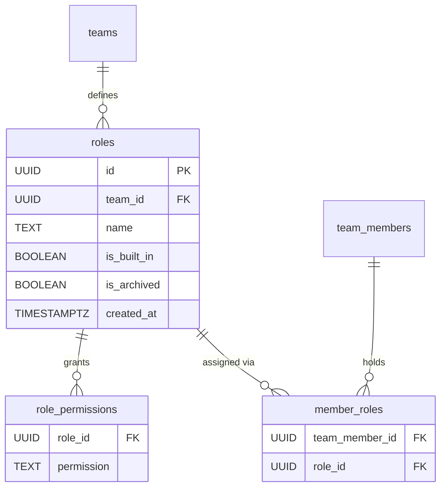

---

### Groups

`groups` are hierarchical sub-divisions of a team (e.g. age brackets, skill tiers). They support self-referential parent/child nesting via `parent_id`. `group_members` links team members to groups. `age_threshold_rules` define automatic age-based group assignment boundaries. `role_groups` associates roles with groups, restricting which roles are visible or applicable within a group context.

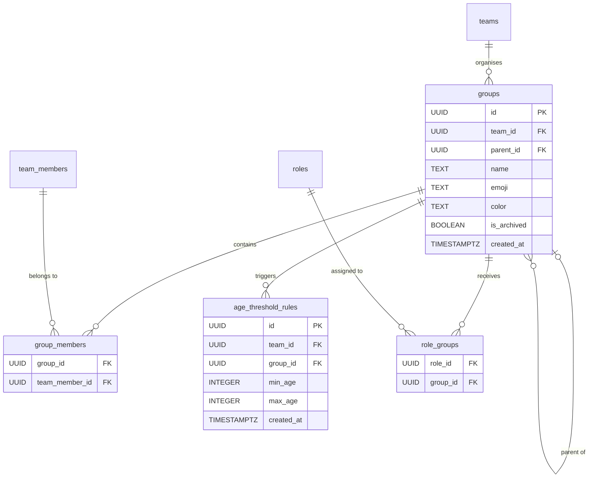

---

### Training Types

`training_types` categorise team activities (e.g. strength, tactical). Each type optionally belongs to an owner group and may restrict member visibility to another group. `role_training_types` controls which roles have access to a training type.

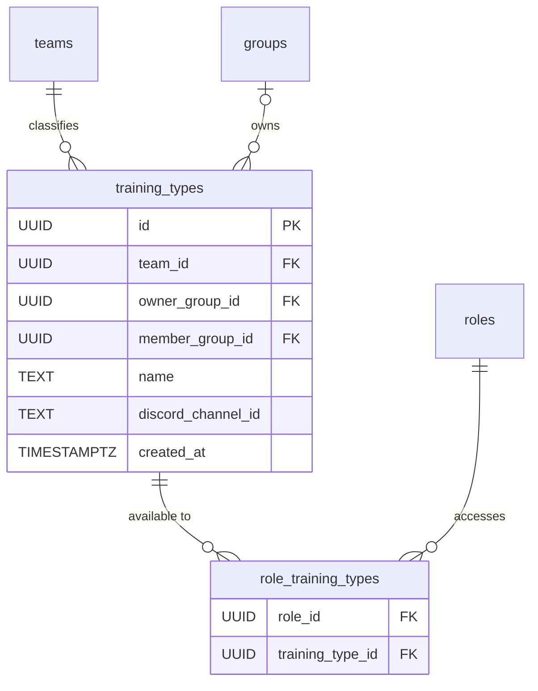

---

### Events

`events` are individual scheduled occurrences. `event_series` are recurring schedules that generate individual event rows on a rolling horizon. `event_rsvps` capture each team member's attendance response for a given event.

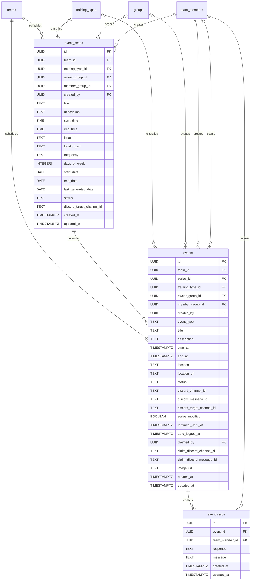

---

### Discord Integration

This domain bridges the application to a Discord bot. `bot_guilds` tracks which Discord servers the bot has joined. `discord_channels` caches the channel list for each guild. `discord_role_mappings` and `discord_channel_mappings` link application roles and groups to their Discord counterparts. The three sync-event tables (`role_sync_events`, `channel_sync_events`, `event_sync_events`) are outbox tables consumed by the bot worker to propagate state changes to Discord. `channel_event_dividers` tracks the single divider message posted in each event channel to visually separate past events from upcoming ones.

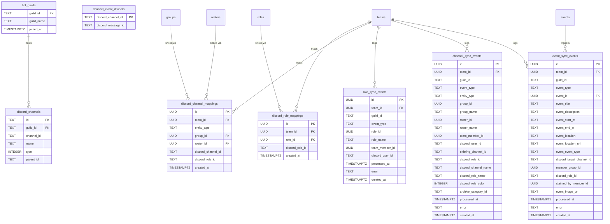

---

### Activity Tracking

`activity_logs` record individual physical activity sessions for a team member. `activity_types` defines the catalogue of activity kinds — a set of global built-in slugs (gym, running, stretching, training) plus optional team-specific custom types.

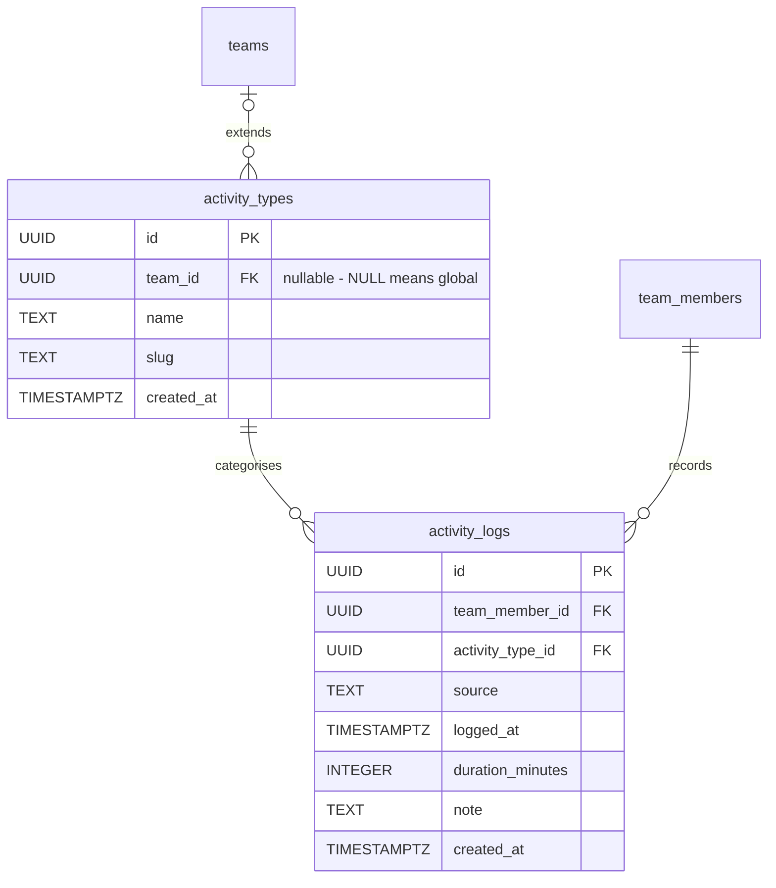

---

### Rosters

`rosters` are named lists of team members used for match-day squad selection. `roster_members` is the join table that adds a team member to a roster.

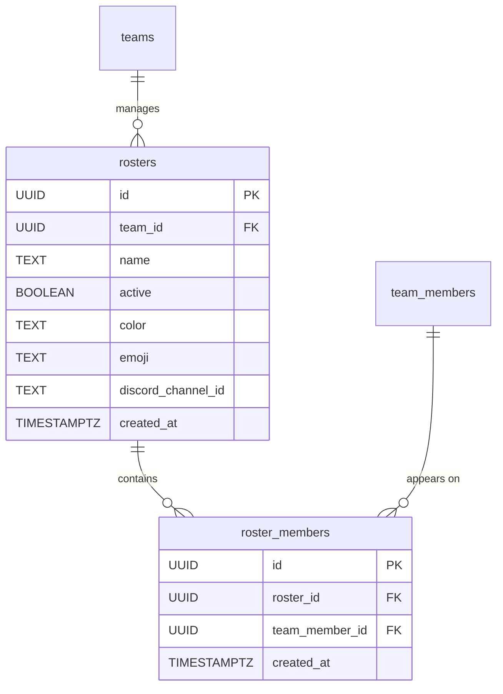

---

### Calendar

`ical_tokens` store per-user secret tokens that are embedded in a private iCal feed URL, allowing external calendar applications to subscribe to a user's team events without requiring authentication.

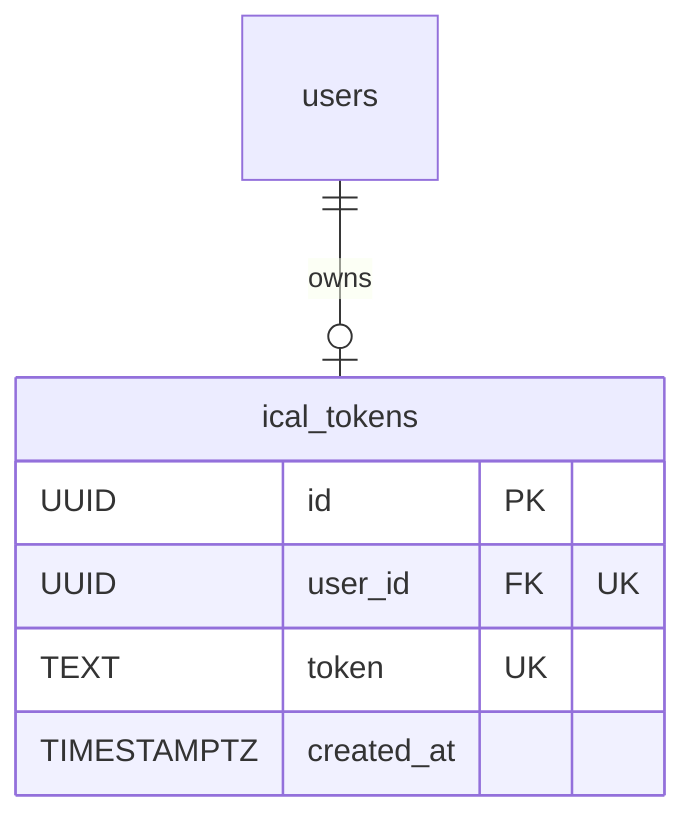

---

### Notifications

`notifications` are in-app alert records scoped to a specific team and user. The `is_read` flag drives unread badge counts; a partial index on `(user_id, is_read) WHERE is_read = false` makes unread queries efficient.

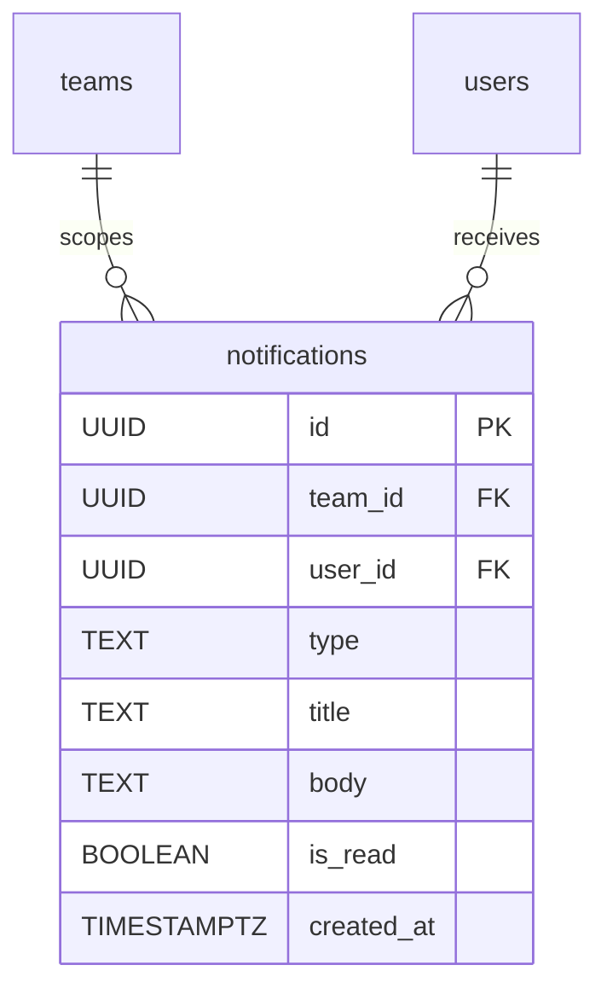

---

## Entity Summary

| Table | Description |
|---|---|
| `users` | Core identity record for every person who has signed in via Discord OAuth. |
| `sessions` | Short-lived server-side authentication tokens issued to logged-in users. |
| `oauth_connections` | OAuth access and refresh tokens per user per provider (currently Discord only). |
| `ical_tokens` | Long-lived secret token that enables unauthenticated iCal feed access per user. |
| `teams` | Top-level organisational unit tied one-to-one with a Discord guild. |
| `team_members` | Membership record joining a user to a team, carrying per-team profile data. |
| `team_invites` | Invite codes that allow new users to join a specific team, optionally pre-assigning them to a group. |
| `team_settings` | One-to-one extension of teams holding configurable operational defaults. |
| `pending_teams` | Archive of teams that existed before mandatory guild linking was enforced. |
| `roles` | Named permission bundles defined per team; built-in roles are seeded automatically. |
| `role_permissions` | Individual permission strings granted to a role. |
| `member_roles` | Many-to-many junction assigning roles to team members. |
| `groups` | Hierarchical sub-divisions of a team (e.g. age brackets, skill tiers). |
| `group_members` | Many-to-many junction placing team members in groups. |
| `age_threshold_rules` | Rules that automatically assign members to a group based on age range. |
| `role_groups` | Many-to-many junction associating roles with groups. |
| `training_types` | Named categories for training activities, optionally restricted by group and role. |
| `role_training_types` | Many-to-many junction controlling which roles can access a training type. |
| `events` | Individual scheduled occurrences (training, match, tournament, etc.). |
| `event_series` | Recurring event schedules that generate individual event rows on a rolling horizon. |
| `event_rsvps` | Attendance responses (yes / no / maybe) submitted by team members for events. |
| `bot_guilds` | Registry of Discord servers where the Sideline bot is installed. |
| `discord_channels` | Cached channel list fetched from Discord for each bot guild. |
| `discord_role_mappings` | Links an application role to its corresponding Discord role. |
| `discord_channel_mappings` | Links an application group to its corresponding Discord channel. |
| `role_sync_events` | Outbox records driving role-assignment changes in Discord. |
| `channel_sync_events` | Outbox records driving channel-membership changes in Discord. |
| `event_sync_events` | Outbox records driving event announcements and updates in Discord. |
| `channel_event_dividers` | Tracks the divider message ID posted in each event channel to separate past from upcoming events. |
| `activity_types` | Catalogue of activity kinds; global built-ins plus optional team-specific custom types. |
| `activity_logs` | Individual physical activity session records belonging to a team member. |
| `rosters` | Named match-day squad lists managed per team. |
| `roster_members` | Many-to-many junction placing team members on a roster. |
| `notifications` | In-app alert records scoped to a team and user, with read/unread tracking. |
