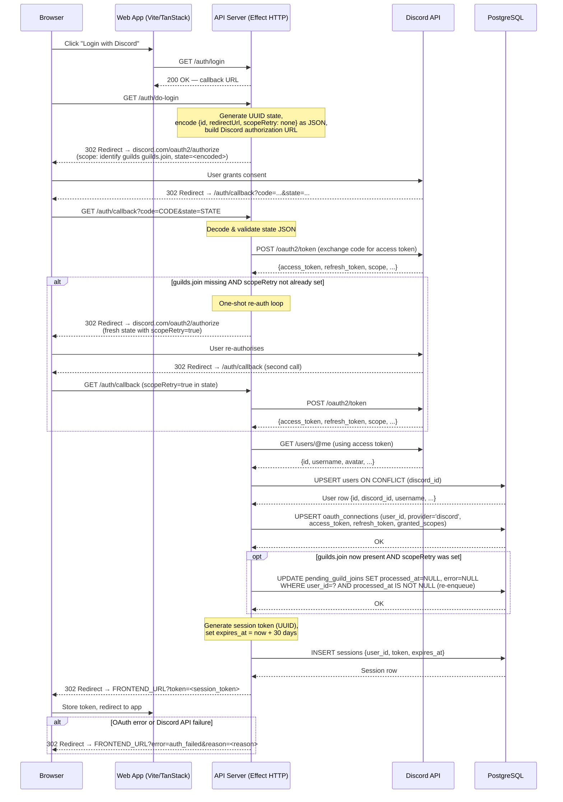
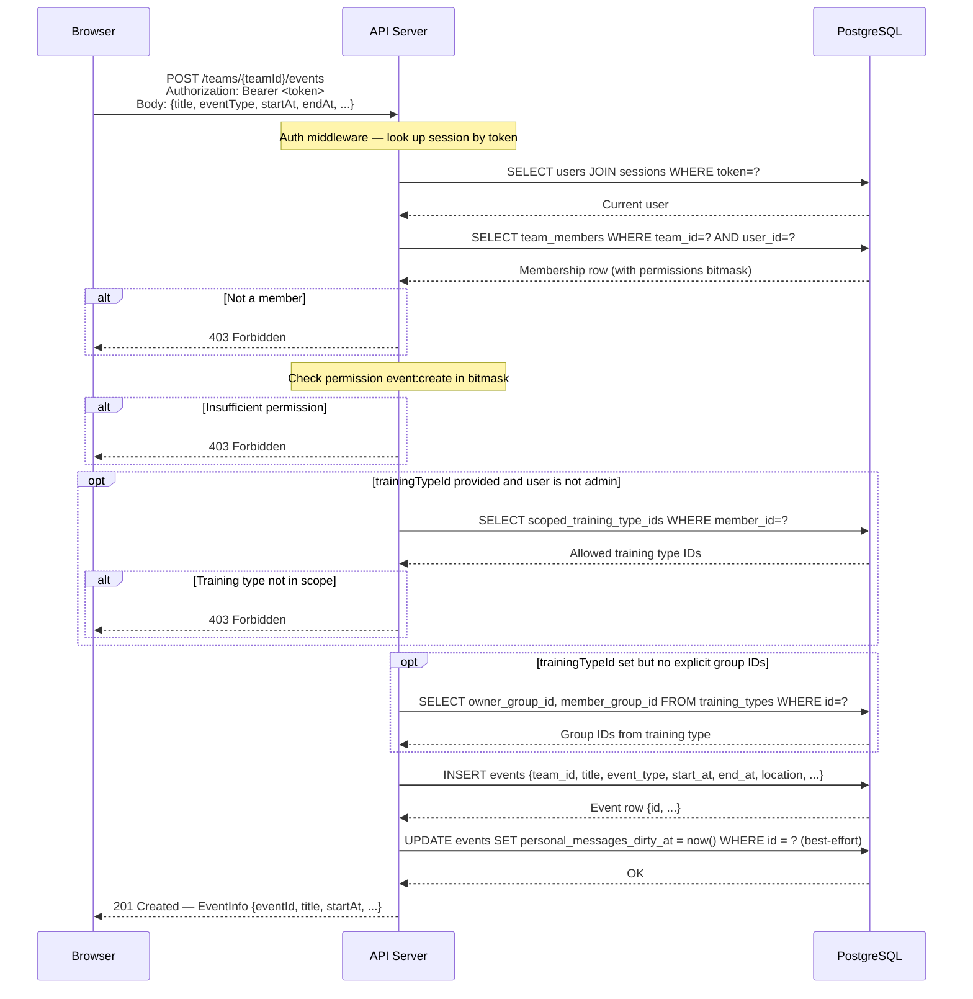
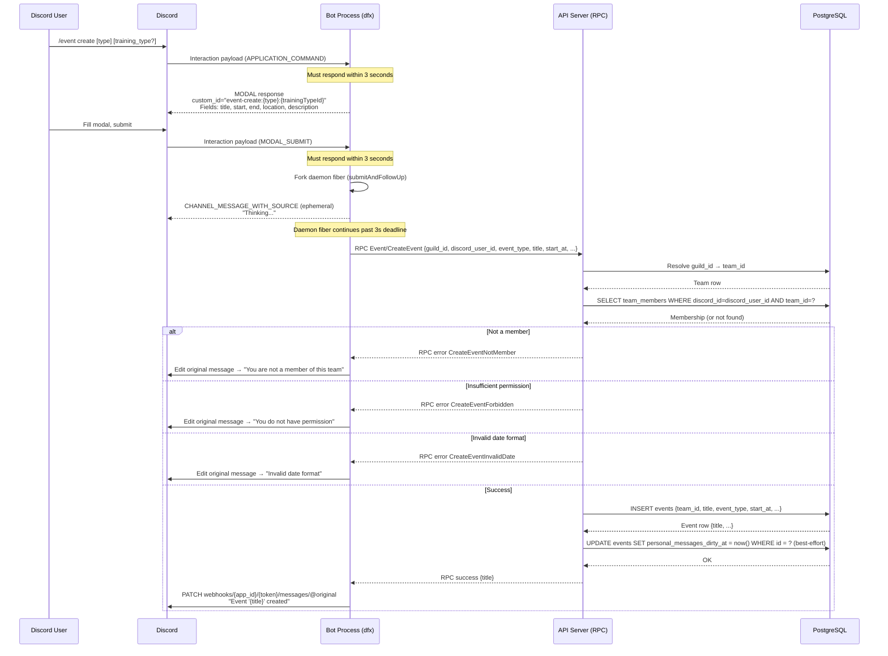
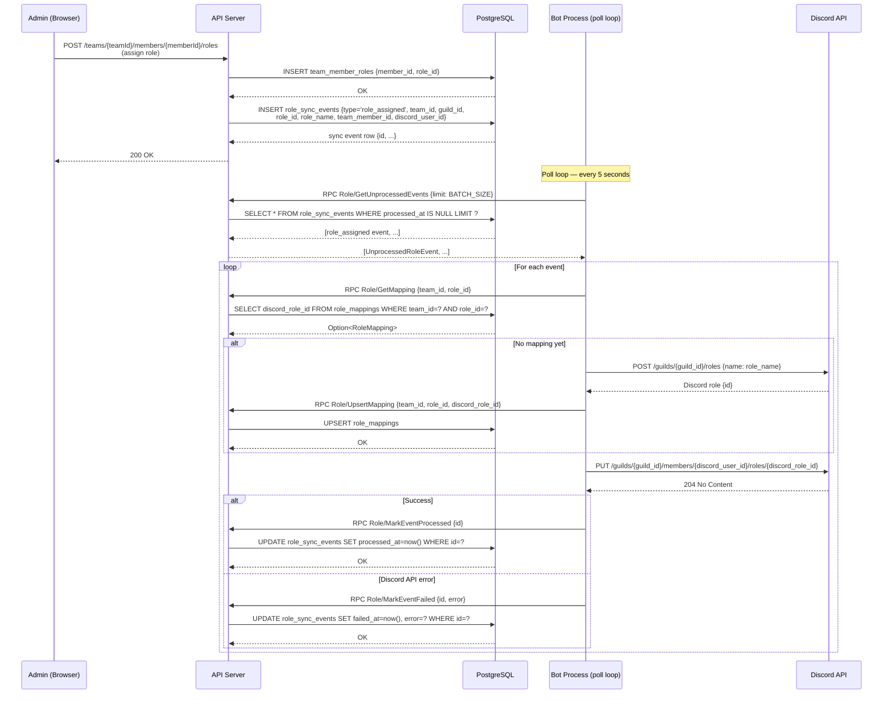
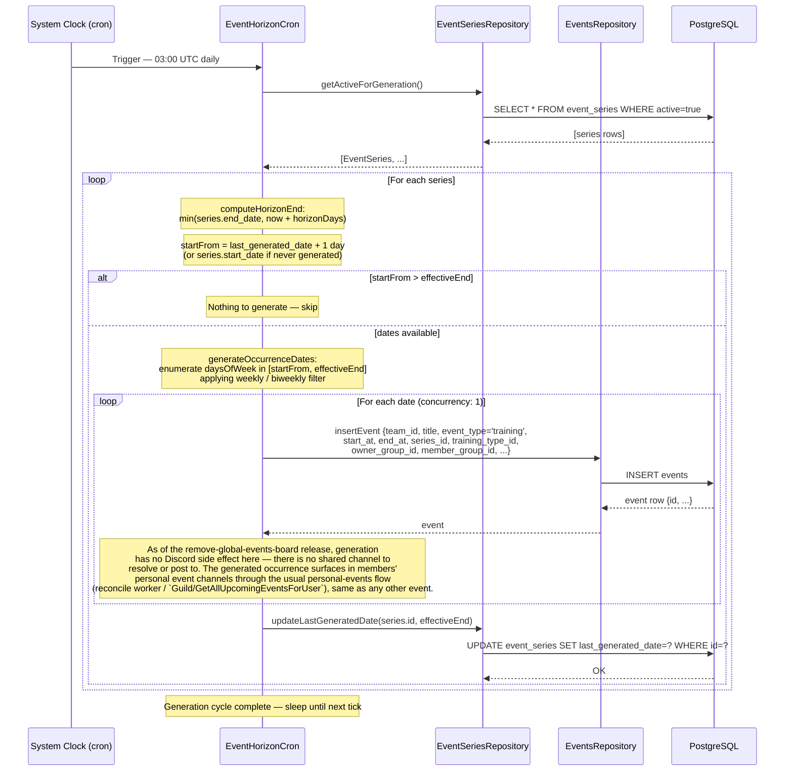
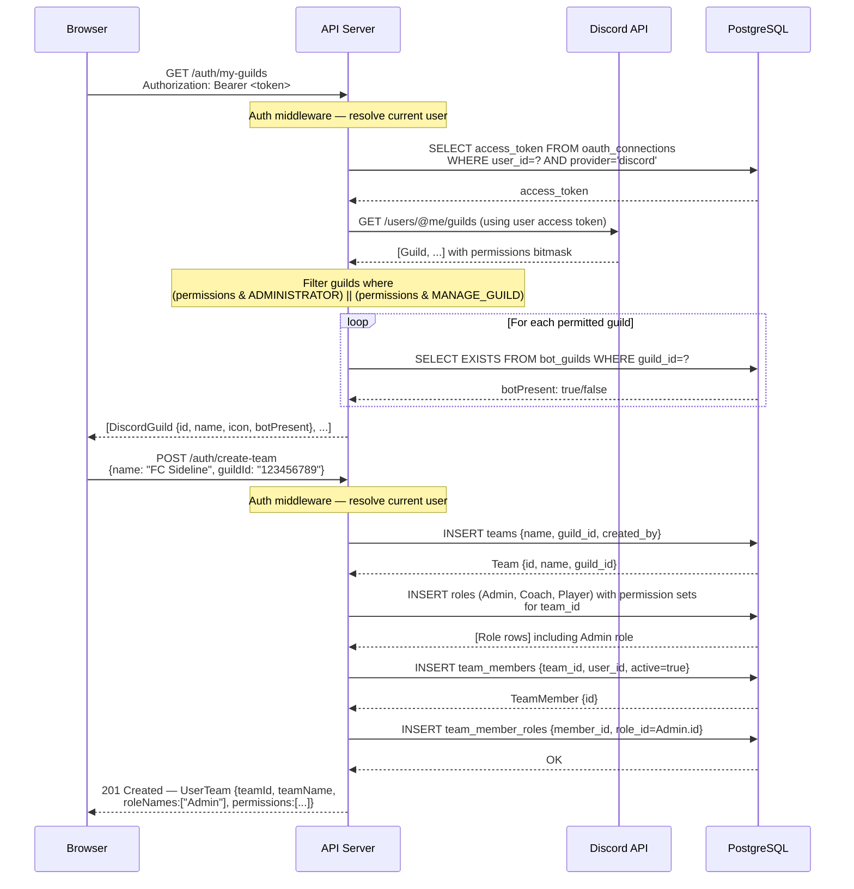
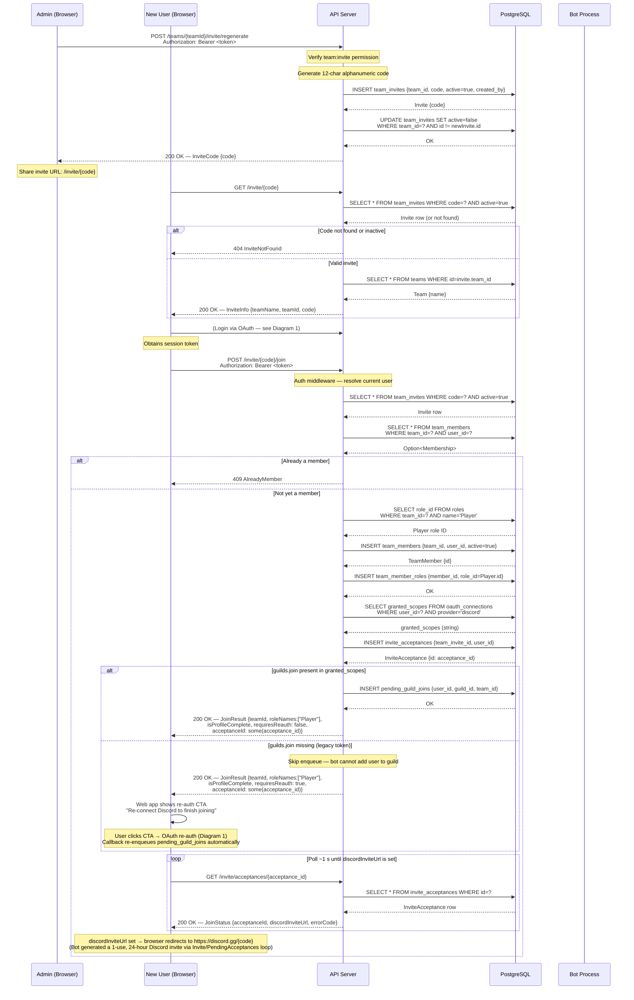
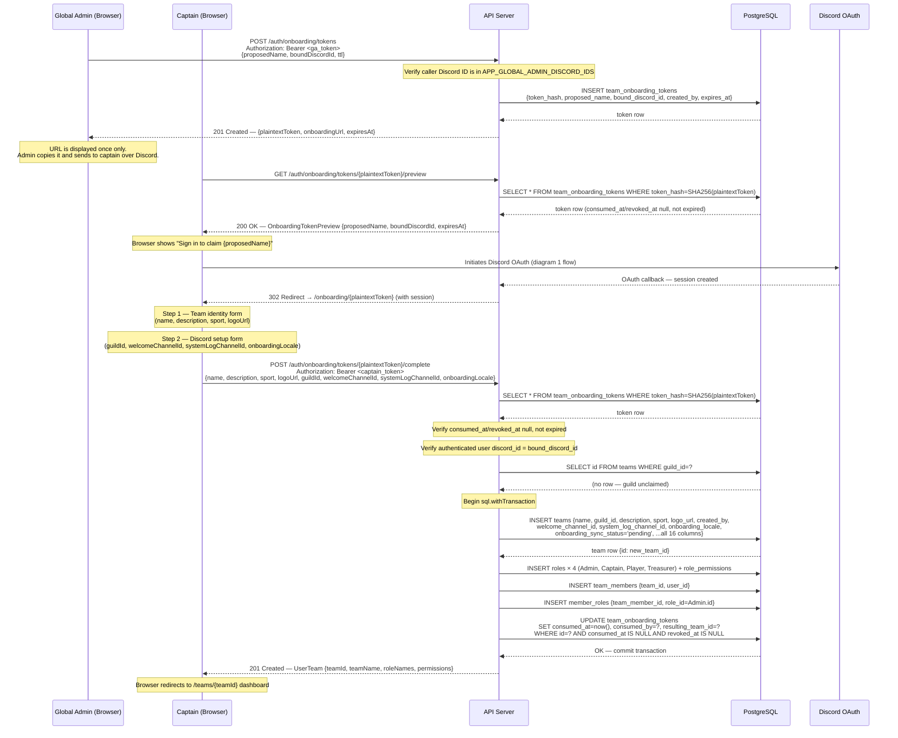
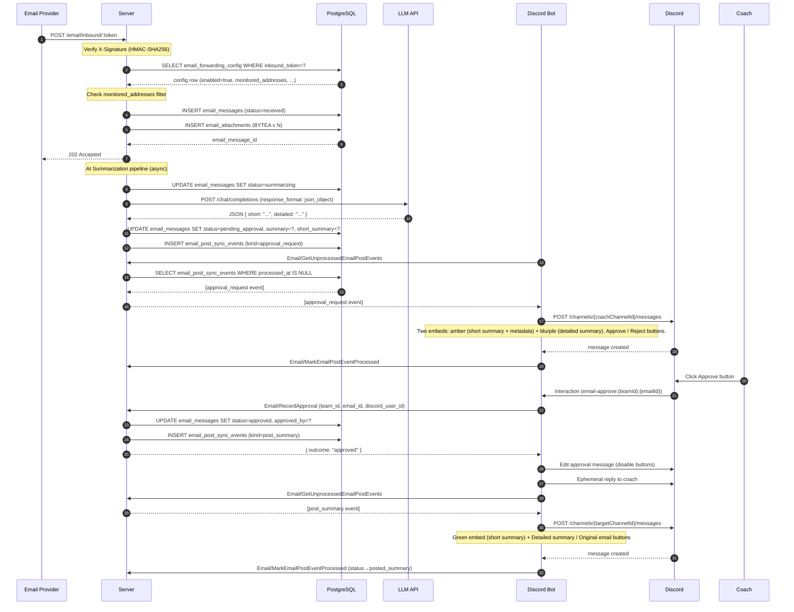

# Sideline — Core System Sequence Diagrams

This document provides sequence diagrams for the twelve core flows in the Sideline platform. Each diagram is accompanied by a brief description of the flow and its key design decisions. The diagrams use Mermaid `sequenceDiagram` syntax and are intended for inclusion in a bachelor's thesis.

---

## 1. Discord OAuth2 Login Flow

A user initiates login through the web application. The server generates a state token containing a redirect URL, constructs the Discord authorization URL, and redirects the browser to Discord. After the user grants consent, Discord redirects back to the server callback with an authorization code. The server exchanges the code for an access token, fetches the user's Discord profile via the REST API, upserts the user and OAuth connection records (including the space-separated `granted_scopes` list) in PostgreSQL, and finally creates a 30-day session. The session token is returned to the browser as a query parameter on the redirect.

If the received token set is missing the `guilds.join` scope (which can happen for users who authenticated before this scope was required), the callback performs a one-shot re-authorisation loop: it redirects the browser back to Discord with a fresh state that carries `scopeRetry=true`. On the second callback the scope is present; the server then re-enqueues any `pending_guild_joins` rows that previously failed for the user and proceeds normally. If the second callback still lacks the scope, the server proceeds without re-enqueuing.



---

## 2. Event Creation via Web App

An authenticated team member with the `event:create` permission creates an event through the web interface. The server validates the session token, checks team membership, enforces role-based permissions, optionally resolves group scoping from the training type, inserts the event, and marks the event's personal-channel messages dirty so the bot's personal-events reconcile worker posts an embed into each eligible member's own personal event channel (there is no shared/global Discord channel to post to as of the remove-global-events-board release).



---

## 3. Event Creation via Discord Bot (Slash Command + Modal)

A Discord user runs a slash command (e.g., `/event create`) inside a guild. The bot responds immediately with a modal form (Discord requires a response within 3 seconds). The user fills in the modal fields. On submission the bot immediately acknowledges with an ephemeral "thinking" message (again within 3 seconds), then forks a daemon fiber that calls the server via the typed RPC protocol (`Event/CreateEvent`). The RPC handler on the server resolves the guild to a team, checks membership and permissions, inserts the event, and marks the event's personal-channel messages dirty so it appears in each eligible member's personal event channel via the reconcile worker. The bot's daemon fiber then edits the original ephemeral message with the result.



---

## 4. RSVP via Discord Button

An event embed posted to a member's personal event channel (or shown via `/event list`) contains RSVP buttons (Yes / No / Coming later, `custom_id="upcoming-rsvp:{eventId}:{teamId}:{response}"` for Yes/No). Clicking Yes or No immediately saves the RSVP without opening a modal (flow below). **Coming later is different**: because it requires a non-blank comment, its button never uses the instant-submit custom ID — clicking it goes straight to the message modal (`custom_id="u-add-msg:{teamId}:{eventId}:coming_later"`) described in the "Add a message" flow further down, and the RSVP is only submitted once that modal is filled in and submitted; if the submitted message ends up blank (and there is no prior stored message to fall back to), the server rejects with `RsvpMessageRequired` instead of recording the response. The ephemeral confirmation includes a `[💬 Add a message]` button if no message exists, or `[💬 Edit message]` and (for Yes/No only — never for Coming later, since clearing would leave the mandatory comment blank) `[🗑️ Clear message]` buttons if a message is already stored. As of the remove-global-events-board release there is no shared board embed to rebuild synchronously on click: the bot only posts a late-RSVP notification (if applicable), and the member's personal-channel message content is refreshed asynchronously by the server-side dirty-mark + personal-events reconcile worker. (The legacy `custom_id="rsvp:{teamId}:{eventId}:{response}"` button, fixed to the historical `yes`/`no`/`maybe` values, is still handled for any pre-existing shared-board message an admin hasn't deleted yet, but no new message uses it.)

```mermaid
sequenceDiagram
    participant User as Discord User
    participant Discord
    participant Bot as Bot Process
    participant Server as API Server (RPC)
    participant DB as PostgreSQL

    User->>Discord: Click RSVP button (custom_id="upcoming-rsvp:{eventId}:{teamId}:{response}")
    Discord->>Bot: Interaction payload (MESSAGE_COMPONENT)

    Note over Bot: Must respond within 3 seconds
    Bot->>Bot: Fork daemon fiber (submitAndFollowUp)
    Bot-->>Discord: CHANNEL_MESSAGE_WITH_SOURCE (ephemeral)<br/>"Thinking..."

    Note over Bot: Daemon fiber continues

    Bot->>Server: RPC Event/SubmitRsvp {event_id, team_id, discord_user_id, response,<br/>message: none, clearMessage: false}

    Server->>DB: Resolve discord_user_id → team_member_id for team
    DB-->>Server: Member (or not found)

    alt Member not found
        Server-->>Bot: RPC error RsvpMemberNotFound
        Bot->>Discord: Edit original ephemeral → "You are not a member of this team"
    else Event not found
        Server-->>Bot: RPC error RsvpEventNotFound
        Bot->>Discord: Edit original ephemeral → "Event not found"
    else RSVP deadline passed
        Server-->>Bot: RPC error RsvpDeadlinePassed
        Bot->>Discord: Edit original ephemeral → "RSVP deadline has passed"
    else Not in member group
        Server-->>Bot: RPC error RsvpNotGroupMember
        Bot->>Discord: Edit original ephemeral → "You are not in the event's member group"
    else response = coming_later and effective message is blank
        Server-->>Bot: RPC error RsvpMessageRequired
        Bot->>Discord: Edit original ephemeral → "A reason is required when choosing 'Coming later'"
    else Success
        Server->>DB: UPSERT event_rsvps {event_id, member_id, response}<br/>message = COALESCE(new_message, existing_message)
        DB-->>Server: SubmitRsvpResult {yes, no, maybe, isLateRsvp, lateRsvpChannelId, message}<br/>(maybe here also folds in coming_later)

        Server-->>Bot: RPC success — SubmitRsvpResult
        Server->>DB: UPDATE events SET personal_messages_dirty_at = now() (server-side, decoupled from this call)

        Note over Bot: postRsvpDiscordUpdates (concurrent) — late-RSVP notification only;<br/>no shared board embed to rebuild
        opt isLateRsvp = true and lateRsvpChannelId present
            Bot->>Server: RPC Event/GetEventEmbedInfo {event_id} (event title for the notice)
            Bot->>Discord: GET /guilds/{guild_id} (fetch preferred locale)
            Discord-->>Bot: Guild {preferred_locale}
            Bot->>Discord: POST /channels/{lateRsvpChannelId}/messages<br/>(orange embed — late RSVP notification)
        end

        Note over Bot: Determine action row buttons<br/>message present → [Edit message] [Clear message] (Clear omitted for coming_later)<br/>no message → [Add a message]
        Bot->>Discord: Edit original ephemeral → "Your response (Yes/No/Coming later) has been recorded"<br/>+ action row with message management buttons

        Note over DB: Asynchronously, the personal-events reconcile worker (10s poll)<br/>picks up the dirty event and edits the member's personal-channel<br/>message with the updated RSVP counts
    end

    opt User clicks [Add a message] or [Edit message] (custom_id="rsvp-add-msg:…")
        User->>Discord: Click "Add a message" / "Edit message" button
        Discord->>Bot: Interaction payload (MESSAGE_COMPONENT)

        Note over Bot: Must respond within 3 seconds
        Bot-->>Discord: MODAL response<br/>custom_id="rsvp-modal:{teamId}:{eventId}:{response}"<br/>Field: message (max 200 chars; required and non-empty when response = coming_later, optional otherwise)

        User->>Discord: Fill message field, submit modal
        Discord->>Bot: Interaction payload (MODAL_SUBMIT)

        Note over Bot: Must respond within 3 seconds
        Bot->>Bot: Fork daemon fiber
        Bot-->>Discord: CHANNEL_MESSAGE_WITH_SOURCE (ephemeral)<br/>"Thinking..."

        Bot->>Server: RPC Event/SubmitRsvp {event_id, team_id, discord_user_id, response,<br/>message: some(text), clearMessage: false}
        Server->>DB: UPSERT event_rsvps — set message = provided text
        DB-->>Server: SubmitRsvpResult {message: some(text), ...}
        Server-->>Bot: RPC success

        Note over Bot: postRsvpDiscordUpdates — late-RSVP notification only (no embed to rebuild)
        Bot->>Discord: Edit original ephemeral → "Message saved."<br/>+ [Edit message] [Clear message] buttons
    end

    opt User clicks [Clear message] (custom_id="rsvp-clear-msg:…")
        User->>Discord: Click "Clear message" button
        Discord->>Bot: Interaction payload (MESSAGE_COMPONENT)

        Note over Bot: Must respond within 3 seconds
        Bot->>Bot: Fork daemon fiber
        Bot-->>Discord: CHANNEL_MESSAGE_WITH_SOURCE (ephemeral)<br/>"Thinking..."

        Bot->>Server: RPC Event/SubmitRsvp {event_id, team_id, discord_user_id, response,<br/>message: none, clearMessage: true}
        Server->>DB: UPSERT event_rsvps — set message = NULL
        DB-->>Server: SubmitRsvpResult {message: none, ...}
        Server-->>Bot: RPC success

        Note over Bot: postRsvpDiscordUpdates — late-RSVP notification only (no embed to rebuild)
        Bot->>Discord: Edit original ephemeral → "Message cleared."<br/>+ [Add a message] button
    end
```

---

## 5. Discord Role Sync (Outbound)

When an admin assigns a Sideline role to a team member via the web app, the server writes a `role_assigned` event row to the `role_sync_events` table. The bot runs a polling loop every 5 seconds that calls `Role/GetUnprocessedEvents` over RPC. For each event the bot ensures a Discord role mapping exists (creating the Discord role if necessary), calls the Discord API to assign the role to the member in the guild, then marks the event as processed. Failed events are marked with an error string for later inspection.



---

## 6. Recurring Event Generation (Cron)

The `EventHorizonCron` runs on a daily schedule (`0 3 * * *` UTC). On each tick it fetches all active event series from the database, computes the generation horizon end date (the lesser of the series end date and `now + horizonDays`), calls `generateOccurrenceDates` to enumerate matching weekdays, and inserts one event row per date (sequentially, concurrency 1). As of the remove-global-events-board release, event generation has no Discord side effect — there is no shared channel to resolve or post an embed to; a generated occurrence reaches members' personal event channels the same way any other event does. Finally the cron updates the series' `last_generated_date` to the horizon end. The cron only generates dates from where it left off (`last_generated_date + 1 day`) so it is safe to run repeatedly.



---

## 7. Event Started (Cron)

The `EventStartCron` runs every minute (`* * * * *`). On each tick it first runs a best-effort, once-per-cycle self-healing sweep (`markStalePersonalMessagesDirty`) that re-marks any event which is no longer `active`/upcoming but still holds `personal_event_messages` rows and isn't already dirty — a backstop for events missed by a prior cycle's per-event mark below. It then queries for `active` events whose `start_at` timestamp is in the past, atomically transitions each to `started` status, marks the event's `personal_messages_dirty_at` (so the personal-events reconcile worker removes the finished event from members' personal channels), and emits an `event_started` row in the `event_sync_events` outbox. The bot's Event Sync worker picks up the event and runs two actions in parallel: it posts a fresh "Starting now" announcement to the team's configured reminders channel (or the guild system channel as a fallback), and — for training events — best-effort deletes the training's claim-board message. As of the remove-global-events-board release there is no shared-board embed to edit in place and no channel reorder or `recoverDeletedMessages` recovery step; those were removed along with the shared events board.

```mermaid
sequenceDiagram
    participant Clock as System Clock (cron)
    participant Cron as EventStartCron
    participant EventsRepo as EventsRepository
    participant SyncRepo as EventSyncEventsRepository
    participant DB as PostgreSQL
    participant Bot as Bot Process (poll loop)
    participant Discord as Discord API

    Clock->>Cron: Trigger — every minute

    Cron->>EventsRepo: markStalePersonalMessagesDirty()
    EventsRepo->>DB: UPDATE events SET personal_messages_dirty_at=now()<br/>WHERE id IN (SELECT DISTINCT event_id FROM personal_event_messages)<br/>AND (status<>'active' OR start_at < now())<br/>AND personal_messages_dirty_at IS NULL
    DB-->>EventsRepo: OK (best-effort — failures are logged and swallowed)

    Cron->>EventsRepo: findEventsToStart()
    EventsRepo->>DB: SELECT * FROM events<br/>WHERE status='active' AND start_at <= now()
    DB-->>EventsRepo: [event rows]
    EventsRepo-->>Cron: [Event, ...]

    loop For each event (concurrency: 1)
        Cron->>EventsRepo: startEvent(event.id)
        EventsRepo->>DB: UPDATE events SET status='started'<br/>WHERE id=? AND status='active'
        DB-->>EventsRepo: updated row count

        alt Already started (0 rows updated)
            Note over Cron: Skip — another process beat us (idempotent)
        else Successfully started
            Cron->>EventsRepo: markEventPersonalMessagesDirty(event.id)
            EventsRepo->>DB: UPDATE events SET personal_messages_dirty_at=now()<br/>WHERE id=?
            DB-->>EventsRepo: OK (best-effort — failures are logged and swallowed)
            Cron->>SyncRepo: emitEventStarted(team_id, event_id, ...)
            SyncRepo->>DB: INSERT event_sync_events {type='event_started', team_id, event_id, ...}
            DB-->>SyncRepo: OK
            Note over Cron: Log "marked event as started"
        end
    end

    Note over Bot: Poll loop — every 5 seconds
    Bot->>DB: RPC Event/GetUnprocessedEvents {limit: 50}
    DB-->>Bot: [event_started event, ...]

    loop For each event_started event
        Note over Bot: handleStarted — two actions run in parallel.<br/>As of the remove-global-events-board release there is no shared-board<br/>embed to edit or reorder; the finished event disappears from personal<br/>channels separately, via `personal_messages_dirty_at` and the<br/>personal-events reconcile worker (see Event Creation diagrams above).
        par "Starting now" announcement
            Bot->>DB: RPC Event/GetYesAttendeesForEmbed {event_id, member_group_id}
            Bot->>Discord: GET /guilds/{guild_id} (preferred locale, falls back to system channel)
            Discord-->>Bot: Guild {preferred_locale, system_channel_id}
            Note over Bot: Build yellow "Starting now: {title}" embed;<br/>@-mentions the claimed coach (training) or member-group role (other events)
            Bot->>Discord: POST /channels/{reminders_channel_or_system_channel}/messages
        and Best-effort claim-message cleanup (training only)
            Bot->>DB: RPC Event/GetClaimInfo {event_id}
            DB-->>Bot: EventClaimInfo (thread + message IDs, if any)
            Bot->>Discord: DELETE claim-thread message (10008 errors silently swallowed)
        end

        Bot->>DB: RPC Event/MarkEventProcessed {id}
    end
```

---

## 8. Team Creation and Guild Linking

Before creating a team the user must select a Discord guild in which they hold Administrator or Manage Guild permission and where the Sideline bot is already installed. The web app calls `GET /auth/my-guilds`, which uses the stored OAuth access token to list the user's guilds, filters to those with sufficient permissions, and annotates each with a `botPresent` flag. The user selects a guild and submits the team creation form. The server inserts the team, seeds default roles with their permission sets (Admin, Coach, Player), creates a team membership for the creator, and assigns the Admin role.



---

## 9. Member Onboarding via Group-Targeted Invite

A captain creates a group-targeted invite (e.g. for the "First Team" group) from the web app. The captain shares only the `/invite/{code}` web link. A new player clicks it, completes the Discord OAuth login, and clicks "Accept". The server creates an `invite_acceptances` row and returns an `acceptanceId`. The bot's invite generator picks up the pending row (~1 s), creates a single-use Discord invite for the welcome channel, and writes the code back. The web app polls `GET /invite/acceptances/:acceptanceId` and redirects the user to `https://discord.gg/{discord_code}` as soon as the URL is available. The user joins the Discord server; the bot detects `GUILD_MEMBER_ADD`, identifies the code via the invite diff, calls `Guild/RegisterMember` — which now resolves via `invite_acceptances.discord_code` — auto-adds the member to the group, renders the welcome message, and posts the welcome embed and system log.

```mermaid
sequenceDiagram
    participant Captain as Captain (Browser)
    participant Server as API Server
    participant DB as PostgreSQL
    participant NewUser as New Player (Browser/Discord)
    participant Discord as Discord Gateway
    participant Bot as Bot Process
    participant REST as Discord REST

    Captain->>Server: POST /teams/{teamId}/invites<br/>{groupId: "first-team-id", expiresAt: null}
    Server->>DB: INSERT team_invites {team_id, code, active=true,<br/>group_id="first-team-id", created_by}
    DB-->>Server: TeamInvite {code}
    Server-->>Captain: 200 OK — InviteCode {code, active: true}

    Note over Captain: Share /invite/{code} (web URL only)

    NewUser->>Server: GET /invite/{code}
    Server->>DB: SELECT team_invites JOIN groups JOIN users (inviter)<br/>WHERE code=? AND active=true
    DB-->>Server: {team_name, team_id, code, group_name="First Team", inviter_username}
    Server-->>NewUser: 200 OK — InviteInfo {teamName, code, groupName, inviterName}

    NewUser->>Server: (Login via Discord OAuth — see Diagram 1)

    NewUser->>Server: POST /invite/{code}/join<br/>Authorization: Bearer <token>
    Server->>DB: INSERT invite_acceptances {team_invite_id, user_id}
    DB-->>Server: InviteAcceptance {id: acceptance_id}
    Server-->>NewUser: 200 OK — JoinResult {teamId, roleNames:["Player"],<br/>isProfileComplete, requiresReauth: false,<br/>acceptanceId: some(acceptance_id)}

    loop Poll every ~1 s until discord_code appears
        NewUser->>Server: GET /invite/acceptances/{acceptance_id}
        Server->>DB: SELECT * FROM invite_acceptances WHERE id=?
        DB-->>Server: {discord_code: null, ...} (pending)
        Server-->>NewUser: 200 OK — JoinStatus {acceptanceId, discordInviteUrl: null, errorCode: null}
    end

    Bot->>Server: RPC Invite/PendingAcceptances {limit: 20}
    Server->>DB: SELECT ia.id, t.guild_id, t.welcome_channel_id<br/>FROM invite_acceptances ia JOIN team_invites ti JOIN teams t<br/>WHERE ia.discord_code IS NULL AND ia.discord_code_error_code IS NULL
    DB-->>Server: [{acceptance_id, guild_id, welcome_channel_id}]
    Server-->>Bot: [{acceptance_id, guild_id, welcome_channel_id}]

    Bot->>REST: POST /channels/{welcome_channel_id}/invites<br/>{max_uses: 1, max_age: 86400, unique: true}
    REST-->>Bot: {code: "{discord_code}"}

    Bot->>Server: RPC Invite/SetAcceptanceDiscordCode<br/>{acceptance_id, discord_code: "{discord_code}"}
    Server->>DB: UPDATE invite_acceptances SET discord_code=?, generated_at=now()
    DB-->>Server: OK

    NewUser->>Server: GET /invite/acceptances/{acceptance_id}
    Server->>DB: SELECT * FROM invite_acceptances WHERE id=?
    DB-->>Server: {discord_code: "{discord_code}", ...}
    Server-->>NewUser: 200 OK — JoinStatus {discordInviteUrl: "https://discord.gg/{discord_code}"}

    Note over NewUser: Browser redirects to https://discord.gg/{discord_code}
    Note over NewUser: Now a Discord guild member

    Discord->>Bot: GUILD_MEMBER_ADD {guild_id, user, roles}

    Bot->>REST: GET /guilds/{guild_id}/invites
    REST-->>Bot: [{code: "{discord_code}", uses: 1}, ...]

    Note over Bot: InviteCache.diffOnMemberJoin — matched code = {discord_code}

    Bot->>Server: RPC Guild/RegisterMember {guild_id, discord_id, username,<br/>avatar, roles, nickname, display_name,<br/>invite_code: some("{discord_code}")}

    Server->>DB: Upsert user; find/create team_member
    Server->>DB: SELECT ti.*, groups.*, users.* FROM invite_acceptances ia<br/>JOIN team_invites ti JOIN groups JOIN users<br/>WHERE ia.discord_code=? (findByDiscordCodeWithContext)
    DB-->>Server: {team_id, group_id, group_name, inviter_discord_id, inviter_username, team_name}

    Server->>DB: INSERT group_members {group_id, team_member_id}
    DB-->>Server: OK

    Note over Server: applyTemplate(welcome_message_template, {<br/>  memberMention: "<@discord_id>",<br/>  memberName: "display_name",<br/>  inviterMention: "<@inviter_discord_id>",<br/>  inviterName: "inviter_username",<br/>  groupName: "First Team",<br/>  teamName: "FC Sideline"<br/>})

    Server-->>Bot: Option<WelcomeMeta> {<br/>  system_log_channel_id: some(...),<br/>  invite_code: some("{discord_code}"),<br/>  welcome: some({<br/>    welcome_channel_id: some(...),<br/>    welcome_message_rendered: some("Welcome..."),<br/>    group_name: some("First Team"),<br/>    group_color_int: some(0x3498db),<br/>    inviter_discord_id: some(...)<br/>  })<br/>}

    par System log (captain-only channel)
        Bot->>REST: POST /channels/{system_log_channel_id}/messages<br/>embed: {title: "Member joined", fields: [member, invite code, inviter, group]}
        REST-->>Bot: 204 OK
    and Welcome message (public channel)
        Bot->>REST: POST /channels/{welcome_channel_id}/messages<br/>content: "<@memberId>",<br/>embed: {description: rendered, color: 0x3498db,<br/>author: display_name, fields: [{Group: "First Team"}]}
        REST-->>Bot: 204 OK
    end
```

---

## 10. Invite and Join Team (web flow)

An admin generates an invite link (or regenerates one) from the team settings page. The server creates a 12-character alphanumeric code, stores it in `team_invites`, and deactivates any previous codes for that team. A new user visits the invite URL in the browser, which first calls `GET /invite/{code}` to display the team name without authentication. When the user clicks "Accept", the front end redirects through the OAuth login flow (diagram 1), after which the app calls `POST /invite/{code}/join` with the session token. The server validates the code, checks the user is not already a member, resolves the "Player" role ID, inserts the membership, assigns the Player role, creates an `invite_acceptances` row, and returns a `JoinResult` containing the acceptance ID. The web app polls `GET /invite/acceptances/:acceptanceId` until the bot writes the single-use Discord invite code (typically within 1 second), then redirects to `https://discord.gg/{discord_code}`.

If the user's OAuth token is missing the `guilds.join` scope (a legacy user who authenticated before the scope was added), `joinViaInvite` skips the pending-guild-join enqueue and returns `requiresReauth: true`. The web app then shows a re-authorisation prompt. When the user re-authenticates via Discord (diagram 1), the auth callback detects the newly-granted scope and re-enqueues any failed pending-guild-joins automatically; no further action is required from the user.



---

## 11. Team Onboarding — Global Admin Mints Token, Captain Completes Wizard

A global admin mints a single-use onboarding token and sends the URL to the designated captain. The captain opens the URL in the browser, is shown the team identity form after authenticating via Discord OAuth, fills in team identity (step 1) and Discord setup (step 2), and submits. The server validates that the token is active, the authenticated user's Discord ID matches `bound_discord_id`, and the selected guild is not already claimed; it then creates the team, seeds built-in roles and the captain's membership, atomically marks the token consumed, and returns a `UserTeam` object. The captain is redirected to the team dashboard.



---

## 12. Email Forwarding — Inbound Email, AI Summarization, and Coach Approval

An external email provider delivers a message to the Sideline inbound webhook. The server validates the HMAC signature and per-team token, stores the email, and queues it for AI summarization. The AI summarizer calls the LLM and receives a JSON object with two fields: `short` (a brief summary for the Discord team-post embed) and `detailed` (a fuller summary for the approval review). Both are stored in `email_messages`. The server enqueues an `approval_request` outbox event. The bot drains the outbox and posts two embeds to the coach channel: an amber short-summary embed and a blurple detailed-summary embed. The coach clicks **Approve** in Discord; the bot calls the `Email/RecordApproval` RPC. The server transitions the email to `approved` and enqueues a `post_summary` event. The bot drains the new event and posts the short summary to the team channel with **Detailed summary** and **Original email** ephemeral pagination buttons.


