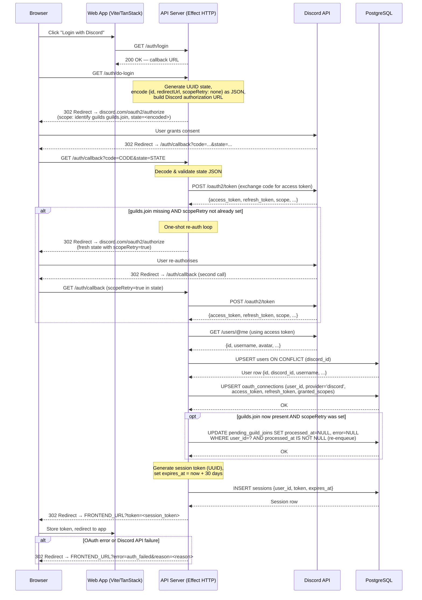
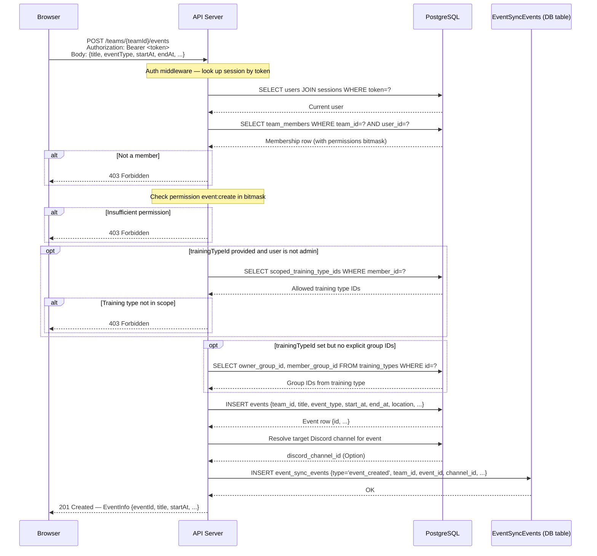
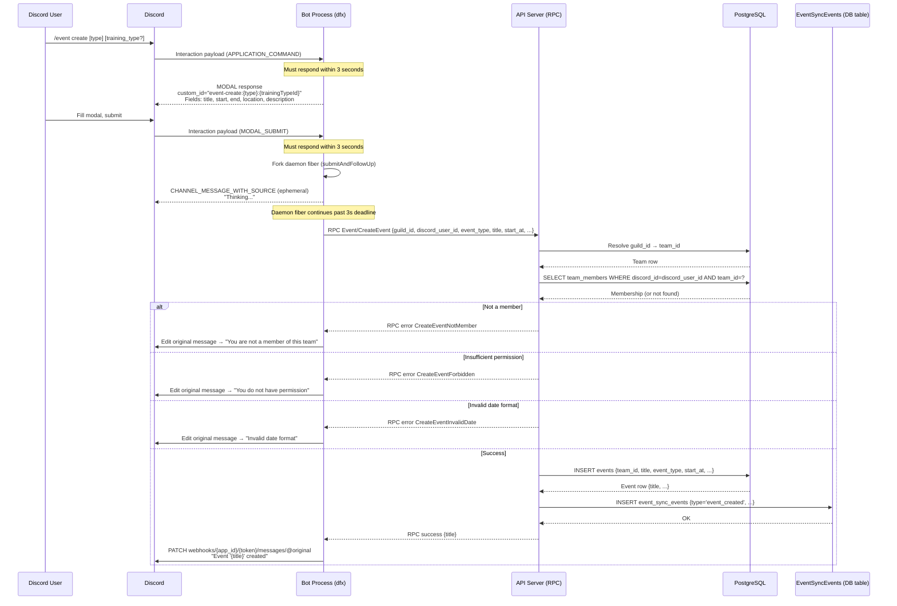
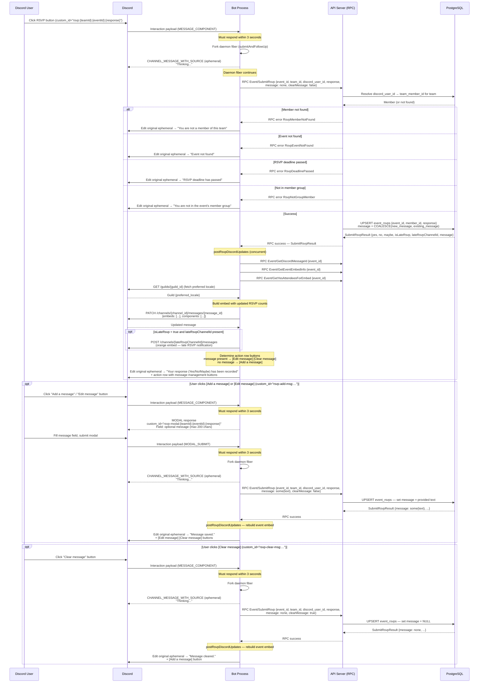
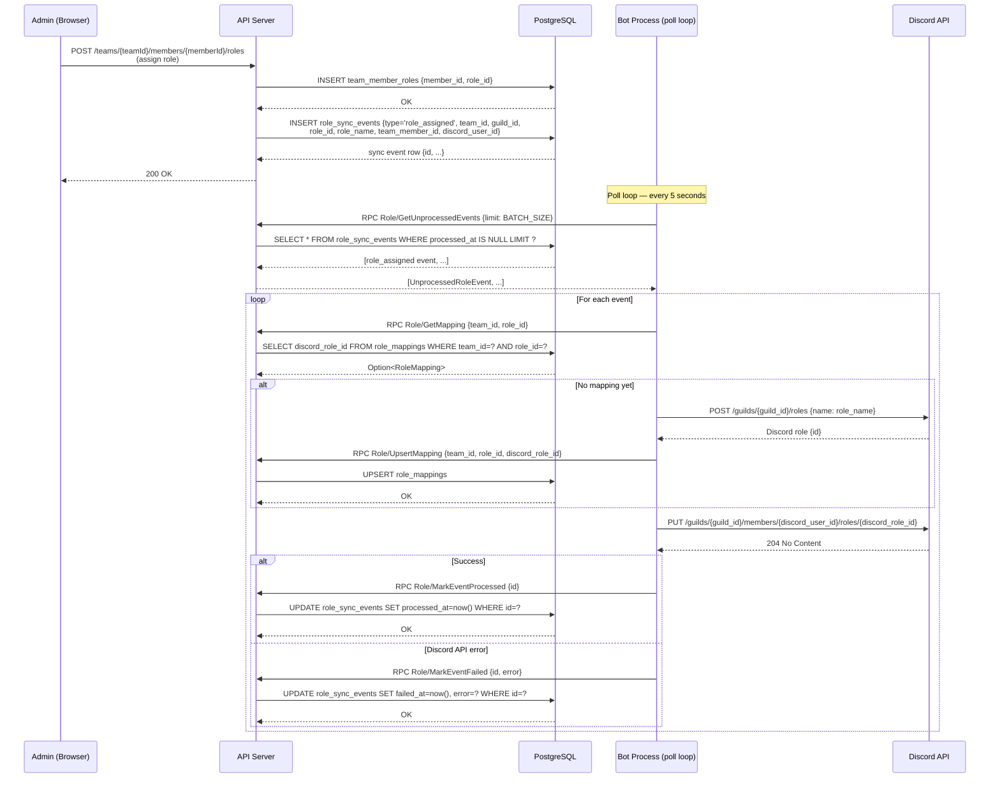
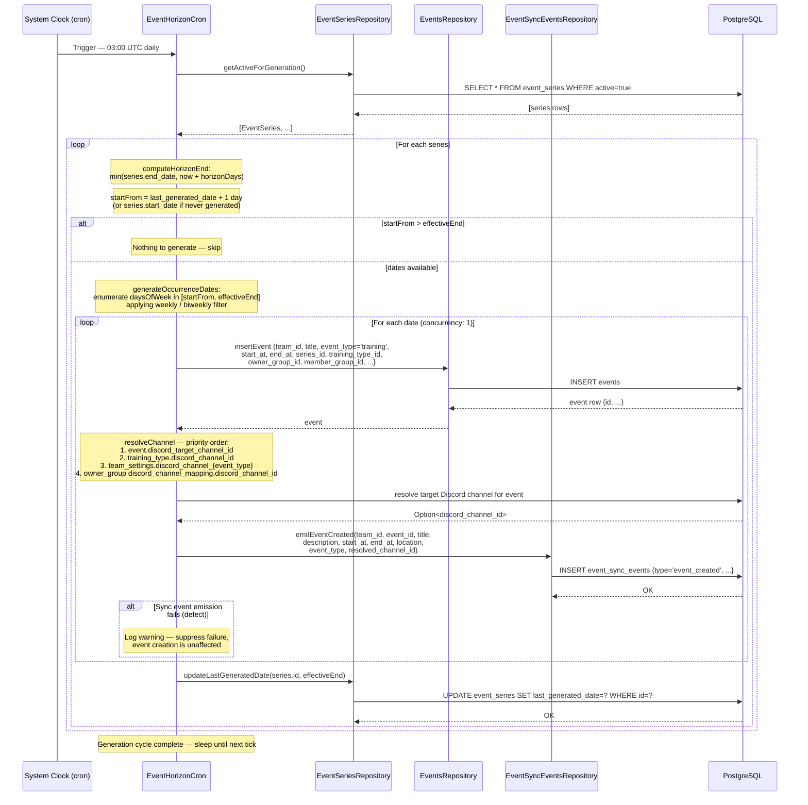
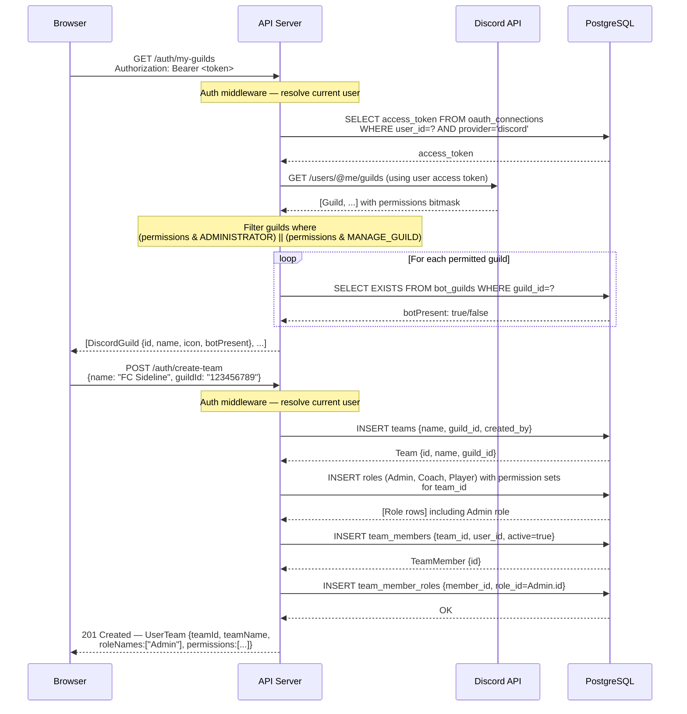
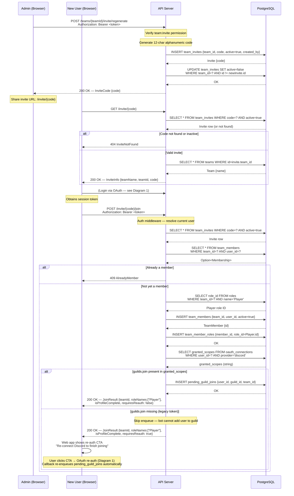

# Sideline — Core System Sequence Diagrams

This document provides sequence diagrams for the nine core flows in the Sideline platform. Each diagram is accompanied by a brief description of the flow and its key design decisions. The diagrams use Mermaid `sequenceDiagram` syntax and are intended for inclusion in a bachelor's thesis.

---

## 1. Discord OAuth2 Login Flow

A user initiates login through the web application. The server generates a state token containing a redirect URL, constructs the Discord authorization URL, and redirects the browser to Discord. After the user grants consent, Discord redirects back to the server callback with an authorization code. The server exchanges the code for an access token, fetches the user's Discord profile via the REST API, upserts the user and OAuth connection records (including the space-separated `granted_scopes` list) in PostgreSQL, and finally creates a 30-day session. The session token is returned to the browser as a query parameter on the redirect.

If the received token set is missing the `guilds.join` scope (which can happen for users who authenticated before this scope was required), the callback performs a one-shot re-authorisation loop: it redirects the browser back to Discord with a fresh state that carries `scopeRetry=true`. On the second callback the scope is present; the server then re-enqueues any `pending_guild_joins` rows that previously failed for the user and proceeds normally. If the second callback still lacks the scope, the server proceeds without re-enqueuing.



---

## 2. Event Creation via Web App

An authenticated team member with the `event:create` permission creates an event through the web interface. The server validates the session token, checks team membership, enforces role-based permissions, optionally resolves group scoping from the training type, inserts the event, resolves the target Discord channel, and emits an `event_created` sync event to the `event_sync_events` queue so the bot can publish an embed to Discord.



---

## 3. Event Creation via Discord Bot (Slash Command + Modal)

A Discord user runs a slash command (e.g., `/event create`) inside a guild. The bot responds immediately with a modal form (Discord requires a response within 3 seconds). The user fills in the modal fields. On submission the bot immediately acknowledges with an ephemeral "thinking" message (again within 3 seconds), then forks a daemon fiber that calls the server via the typed RPC protocol (`Event/CreateEvent`). The RPC handler on the server resolves the guild to a team, checks membership and permissions, inserts the event, and emits a sync event. The bot's daemon fiber then edits the original ephemeral message with the result.



---

## 4. RSVP via Discord Button

An event embed posted to a Discord channel contains RSVP buttons (Yes / No / Maybe). When a member clicks one, the bot immediately saves the RSVP without opening a modal and replies with an ephemeral confirmation. The confirmation includes a `[💬 Add a message]` button if no message exists, or `[💬 Edit message]` and `[🗑️ Clear message]` buttons if a message is already stored. Clicking the add/edit button opens a modal where the member can type an optional message; submitting the modal saves the message via a second `Event/SubmitRsvp` call. At each step the bot rebuilds and edits the original event embed with fresh RSVP counts.



---

## 5. Discord Role Sync (Outbound)

When an admin assigns a Sideline role to a team member via the web app, the server writes a `role_assigned` event row to the `role_sync_events` table. The bot runs a polling loop every 5 seconds that calls `Role/GetUnprocessedEvents` over RPC. For each event the bot ensures a Discord role mapping exists (creating the Discord role if necessary), calls the Discord API to assign the role to the member in the guild, then marks the event as processed. Failed events are marked with an error string for later inspection.



---

## 6. Recurring Event Generation (Cron)

The `EventHorizonCron` runs on a daily schedule (`0 3 * * *` UTC). On each tick it fetches all active event series from the database, computes the generation horizon end date (the lesser of the series end date and `now + horizonDays`), calls `generateOccurrenceDates` to enumerate matching weekdays, and inserts one event row per date (sequentially, concurrency 1). After each insert it resolves the target Discord channel (checking the per-event override, the training-type default, and the team-settings event-type default in order) and emits an `event_created` row in the `event_sync_events` queue so the bot can publish an embed to Discord. If the sync-event emission fails, the failure is logged and suppressed — event insertion is never rolled back due to a notification error. Finally the cron updates the series' `last_generated_date` to the horizon end. The cron only generates dates from where it left off (`last_generated_date + 1 day`) so it is safe to run repeatedly.



---

## 7. Event Started (Cron)

The `EventStartCron` runs every minute (`* * * * *`). On each tick it queries for `active` events whose `start_at` timestamp is in the past, atomically transitions each to `started` status, and emits an `event_started` row in the `event_sync_events` outbox. The bot's Event Sync worker picks up the event, edits the Discord embed to the started state (yellow, no RSVP buttons), and then reorders channel messages so the started event moves into the channel's "past" section. If the original Discord message has been deleted (error 10008), the bot recreates it and persists the new message ID. The reorder applies a cap of `MAX_CHANNEL_EVENTS = 10`: if there are more than 10 events for the channel the oldest past-events beyond the cap are deleted from Discord. Per-channel reorders are serialised by an in-process `ChannelReorderSemaphore`. On bot startup a `recoverDeletedMessages` task scans every channel with stored event messages and reruns the reorder, recreating any messages that were deleted while the bot was offline.

```mermaid
sequenceDiagram
    participant Clock as System Clock (cron)
    participant Cron as EventStartCron
    participant EventsRepo as EventsRepository
    participant SyncRepo as EventSyncEventsRepository
    participant DB as PostgreSQL
    participant Bot as Bot Process (poll loop)
    participant Discord as Discord API

    Clock->>Cron: Trigger — every minute

    Cron->>EventsRepo: findEventsToStart()
    EventsRepo->>DB: SELECT * FROM events<br/>WHERE status='active' AND start_at <= now()
    DB-->>EventsRepo: [event rows]
    EventsRepo-->>Cron: [Event, ...]

    loop For each event (concurrency: 1)
        Cron->>EventsRepo: startEvent(event.id)
        EventsRepo->>DB: UPDATE events SET status='started'<br/>WHERE id=? AND status='active'
        DB-->>EventsRepo: updated row count

        alt Already started (0 rows updated)
            Note over Cron: Skip — another process beat us (idempotent)
        else Successfully started
            Cron->>SyncRepo: emitEventStarted(team_id, event_id, ...)
            SyncRepo->>DB: INSERT event_sync_events {type='event_started', team_id, event_id, ...}
            DB-->>SyncRepo: OK
            Note over Cron: Log "marked event as started"
        end
    end

    Note over Bot: Poll loop — every 5 seconds
    Bot->>DB: RPC Event/GetUnprocessedEvents {limit: 50}
    DB-->>Bot: [event_started event, ...]

    loop For each event_started event
        Bot->>DB: RPC Event/GetDiscordMessageId {event_id}
        DB-->>Bot: Option<{discord_channel_id, discord_message_id}>

        alt No message stored
            Note over Bot: Log warning — skip
        else Message stored
            Bot->>DB: RPC Event/GetRsvpCounts {event_id}
            Bot->>DB: RPC Event/GetEventEmbedInfo {event_id}
            Bot->>DB: RPC Event/GetYesAttendeesForEmbed {event_id}
            Bot->>Discord: GET /guilds/{guild_id} (preferred locale)
            Discord-->>Bot: Guild {preferred_locale}

            Note over Bot: Build started embed — yellow colour,<br/>isStarted=true, components array empty (no RSVP buttons)
            Bot->>Discord: PATCH /channels/{channel_id}/messages/{message_id}<br/>{embeds: [...], components: []}

            alt Discord returns 200 OK
                Discord-->>Bot: Updated message
            else Discord returns 10008 (Unknown Message — deleted)
                Bot->>Discord: POST /channels/{channel_id}/messages (recreate embed)
                Discord-->>Bot: New message {id}
                Bot->>DB: RPC Event/SaveDiscordMessageId {event_id, channel_id, new_message_id}
            end

            Note over Bot: reorderChannelMessages (serialised per channel via ChannelReorderSemaphore)
            Bot->>DB: RPC Event/GetChannelEvents {channel_id}
            DB-->>Bot: sorted entries (past oldest-first · divider · future nearest-first)
            Note over Bot: Apply cap: drop oldest past events beyond MAX_CHANNEL_EVENTS=10
            Bot->>Discord: DELETE cap-dropped messages (if any)
            Note over Bot: Prefix algorithm — keep longest strictly-increasing<br/>snowflake prefix; recreate suffix (delete old → post new)
            Bot->>Discord: PATCH kept-prefix messages (in-place edit)
            Bot->>Discord: DELETE + POST suffix messages (recreate, concurrency: 1)
            Bot->>DB: RPC Event/SaveDiscordMessageId for any recreated messages
        end

        Bot->>DB: RPC Event/MarkEventProcessed {id}
    end

    Note over Bot: Startup task — recoverDeletedMessages
    Bot->>DB: RPC Event/GetChannelsWithStoredMessages
    DB-->>Bot: [{discord_channel_id, guild_id}, ...]

    loop For each channel (concurrency: 3, reorder serialised per channel)
        Bot->>Discord: GET /guilds/{guild_id} (preferred locale)
        Discord-->>Bot: Guild {preferred_locale} (or default 'en' on failure)
        Note over Bot: reorderChannelMessages — cap-drop, prefix/suffix split;<br/>recreates deleted messages and persists new IDs
    end
```

---

## 8. Team Creation and Guild Linking

Before creating a team the user must select a Discord guild in which they hold Administrator or Manage Guild permission and where the Sideline bot is already installed. The web app calls `GET /auth/my-guilds`, which uses the stored OAuth access token to list the user's guilds, filters to those with sufficient permissions, and annotates each with a `botPresent` flag. The user selects a guild and submits the team creation form. The server inserts the team, seeds default roles with their permission sets (Admin, Coach, Player), creates a team membership for the creator, and assigns the Admin role.



---

## 9. Member Onboarding via Group-Targeted Invite

A captain creates a group-targeted invite (e.g. for the "First Team" group) from the web app. The invite link is shared in Discord. A new player clicks the link, completes the Discord OAuth login, and joins the team's Discord guild. The bot detects the join via `GUILD_MEMBER_ADD`, identifies the invite code by diffing usage counts, calls `Guild/RegisterMember` on the server, which resolves the group, auto-adds the member to the group, renders the welcome message, and returns welcome metadata. The bot then posts a public welcome embed to the configured welcome channel and a private system log to the captain-only channel.

```mermaid
sequenceDiagram
    participant Captain as Captain (Browser)
    participant Server as API Server
    participant DB as PostgreSQL
    participant NewUser as New Player (Browser/Discord)
    participant Discord as Discord Gateway
    participant Bot as Bot Process
    participant REST as Discord REST

    Captain->>Server: POST /teams/{teamId}/invites<br/>{groupId: "first-team-id", expiresAt: null}
    Server->>DB: INSERT team_invites {team_id, code, active=true,<br/>group_id="first-team-id", created_by}
    DB-->>Server: TeamInvite {code}
    Server-->>Captain: 200 OK — InviteCode {code, active: true}

    Note over Captain: Share /invite/{code} in Discord

    NewUser->>Server: GET /invite/{code}
    Server->>DB: SELECT team_invites JOIN groups JOIN users (inviter)<br/>WHERE code=? AND active=true
    DB-->>Server: {team_name, team_id, code, group_name="First Team", inviter_username}
    Server-->>NewUser: 200 OK — InviteInfo {teamName, code, groupName, inviterName}

    NewUser->>Server: (Login via Discord OAuth — see Diagram 1)
    Note over NewUser: Now a Discord guild member

    Discord->>Bot: GUILD_MEMBER_ADD {guild_id, user, roles}

    Bot->>REST: GET /guilds/{guild_id}/invites
    REST-->>Bot: [{code, uses: 1}, ...]

    Note over Bot: InviteCache.diffOnMemberJoin — compare fresh<br/>use counts against stored snapshot; matched code = {code}

    Bot->>Server: RPC Guild/RegisterMember {guild_id, discord_id, username,<br/>avatar, roles, nickname, display_name,<br/>invite_code: some("{code}")}

    Server->>DB: Upsert user; find/create team_member
    Server->>DB: SELECT * FROM team_invites JOIN groups JOIN users<br/>WHERE code=? AND active=true (findByCodeWithContext)
    DB-->>Server: {team_id, group_id, group_name, inviter_discord_id, inviter_username, team_name}

    Server->>DB: INSERT group_members {group_id, team_member_id}
    DB-->>Server: OK

    Note over Server: applyTemplate(welcome_message_template, {<br/>  memberMention: "<@discord_id>",<br/>  memberName: "display_name",<br/>  inviterMention: "<@inviter_discord_id>",<br/>  inviterName: "inviter_username",<br/>  groupName: "First Team",<br/>  teamName: "FC Sideline"<br/>})

    Server-->>Bot: Option<WelcomeMeta> {<br/>  system_log_channel_id: some(...),<br/>  invite_code: some("{code}"),<br/>  welcome: some({<br/>    welcome_channel_id: some(...),<br/>    welcome_message_rendered: some("Welcome..."),<br/>    group_name: some("First Team"),<br/>    group_color_int: some(0x3498db),<br/>    inviter_discord_id: some(...)<br/>  })<br/>}

    par System log (captain-only channel)
        Bot->>REST: POST /channels/{system_log_channel_id}/messages<br/>embed: {title: "Member joined", fields: [member, invite code, inviter, group]}
        REST-->>Bot: 204 OK
    and Welcome message (public channel)
        Bot->>REST: POST /channels/{welcome_channel_id}/messages<br/>content: "<@memberId>",<br/>embed: {description: rendered, color: 0x3498db,<br/>author: display_name, fields: [{Group: "First Team"}]}
        REST-->>Bot: 204 OK
    end
```

---

## 10. Invite and Join Team (web flow)

An admin generates an invite link (or regenerates one) from the team settings page. The server creates a 12-character alphanumeric code, stores it in `team_invites`, and deactivates any previous codes for that team. A new user visits the invite URL in the browser, which first calls `GET /invite/{code}` to display the team name without authentication. When the user clicks "Accept", the front end redirects through the OAuth login flow (diagram 1), after which the app calls `POST /invite/{code}/join` with the session token. The server validates the code, checks the user is not already a member, resolves the "Player" role ID, inserts the membership, assigns the Player role, and returns a join result.

If the user's OAuth token is missing the `guilds.join` scope (a legacy user who authenticated before the scope was added), `joinViaInvite` skips the pending-guild-join enqueue and returns `requiresReauth: true`. The web app then shows a re-authorisation prompt. When the user re-authenticates via Discord (diagram 1), the auth callback detects the newly-granted scope and re-enqueues any failed pending-guild-joins automatically; no further action is required from the user.


