# Use Case Diagrams — Sideline

This document presents the use case model for the Sideline sports team management platform. Sideline is a web-based application integrated with Discord that allows sports teams to manage events, rosters, activity tracking, and group membership. The system boundary encompasses the web application (React/TanStack Router front-end), the HTTP API server (Effect-based back-end), and the Discord bot application.

Mermaid `flowchart` diagrams are used throughout this document because Mermaid does not provide native UML use-case notation. Actors are rendered as stadium-shaped nodes (`([Actor])`), use cases as rounded rectangles, and directed edges represent actor-to-use-case participation or include/extend relationships.

---

## 1. Actors

| Actor | Description |
|---|---|
| **Unauthenticated User** | Any visitor who has not yet authenticated via Discord OAuth2. Can view the landing page, follow invite links, and initiate the login flow. |
| **Player** | An authenticated Discord user who is a member of at least one team. Holds the built-in `Player` role granting `roster:view` and `member:view` permissions. Can view events, submit RSVPs, log personal activities, and subscribe to the iCal feed. |
| **Captain** | A team member holding the built-in `Captain` role. Inherits all Player capabilities and additionally holds `roster:manage`, `member:edit`, `role:view`, `event:create`, `event:edit`, `event:cancel`, and `finance:view` permissions. |
| **Admin** | A team member holding the built-in `Admin` role. Holds the full permission set including `team:manage`, `team:invite`, `member:remove`, `role:manage`, `training-type:create`, `training-type:delete`, `finance:view`, `finance:manage_fees`, and `finance:record_payments`, in addition to all Captain permissions. |
| **Treasurer** | A team member holding the built-in `Treasurer` role. Holds `finance:view`, `finance:manage_fees`, and `finance:record_payments`. Used to delegate finance authority without elevating the member to Captain or Admin. |
| **Discord Bot** | The Sideline Discord bot application. Responds to slash commands (`/event list`, `/event create`, `/event overview`, `/finance status`, `/info`, `/makanicko log`, `/makanicko leaderboard`, `/makanicko stats`) and reacts to button interactions on posted embeds (RSVP buttons, upcoming events pagination). Receives RPC calls from the server to synchronise Discord roles and channels. |
| **Global Admin** | A user who is a global admin by either having the `users.is_global_admin` database flag set to `true` or having their Discord ID listed in the `APP_GLOBAL_ADMIN_DISCORD_IDS` server environment variable (the two sources are ORed). The first user to register on a fresh database is automatically promoted via the DB flag. Not scoped to any team. Can read and write global translation overrides via `/api/translations`, allowing UI strings to be changed without a code deployment. Can also mint, list, and revoke team onboarding tokens, enabling new teams to be set up by a designated captain without requiring a pre-existing Sideline account. A global admin with no team memberships is redirected to `/admin/onboarding-tokens` instead of `/no-team`. |
| **System (Cron/Background)** | Automated background processes running inside the API server. Responsible for generating recurring events from event series definitions, transitioning events to `started` status when their start time passes, sending RSVP reminder notifications before events, auto-logging attendance from RSVP data, evaluating age-threshold rules to move members between groups, and queuing payment reminder DMs for members with upcoming or overdue fee assignments. |

---

## 2. Overview Use Case Diagram

High-level view of all actors and the use case domains they interact with.

```mermaid
flowchart LR
    UA(["Unauthenticated User"])
    PL(["Player"])
    CP(["Captain"])
    AD(["Admin"])
    TR(["Treasurer"])
    BOT(["Discord Bot"])
    SYS(["System (Cron)"])
    GLA(["Global Admin"])

    subgraph AUTH["Authentication & Onboarding"]
        UC_LOGIN["Login via Discord OAuth2"]
        UC_ACCEPT_INVITE["Accept Team Invite"]
        UC_COMPLETE_PROFILE["Complete Profile"]
        UC_CREATE_TEAM["Create Team"]
        UC_MINT_TOKEN["Mint Onboarding Token"]
        UC_COMPLETE_ONBOARDING["Complete Team Onboarding Wizard"]
    end

    subgraph TEAM["Team Management"]
        UC_VIEW_MEMBERS["View Members & Rosters"]
        UC_EDIT_MEMBER["Edit Member Details"]
        UC_REMOVE_MEMBER["Remove Member"]
        UC_MANAGE_ROSTER["Manage Rosters"]
        UC_TEAM_SETTINGS["Manage Team Settings"]
        UC_MANAGE_INVITES["Manage Invite Links"]
    end

    subgraph ROLES["Roles & Permissions"]
        UC_VIEW_ROLES["View Roles"]
        UC_MANAGE_ROLES["Create / Edit / Delete Roles"]
        UC_ASSIGN_ROLE["Assign Role to Member"]
    end

    subgraph GROUPS["Groups"]
        UC_VIEW_GROUPS["View Groups"]
        UC_MANAGE_GROUPS["Create / Edit / Delete Groups"]
        UC_GROUP_MEMBERS["Manage Group Members"]
        UC_GROUP_DISCORD["Map Group to Discord Channel"]
        UC_AGE_THRESHOLDS["Manage Age Threshold Rules"]
    end

    subgraph EVENTS["Events & RSVP"]
        UC_VIEW_EVENTS["View Events"]
        UC_CREATE_EVENT["Create Event / Series"]
        UC_EDIT_EVENT["Edit Event / Series"]
        UC_CANCEL_EVENT["Cancel Event / Series"]
        UC_START_EVENT["Mark Event as Started"]
        UC_RSVP["Submit RSVP"]
        UC_VIEW_RSVP["View RSVP Responses"]
    end

    subgraph ACTIVITY["Activity Tracking"]
        UC_LOG_ACTIVITY["Log Activity"]
        UC_VIEW_STATS["View Activity Stats"]
        UC_VIEW_LEADERBOARD["View Leaderboard"]
        UC_MANAGE_TRAINING_TYPES["Manage Training Types"]
    end

    subgraph CALENDAR["Calendar"]
        UC_ICAL["Subscribe to iCal Feed"]
    end

    subgraph DISCORD["Discord Bot"]
        UC_BOT_LIST["List Upcoming Events"]
        UC_BOT_OVERVIEW["Post Events Overview Message"]
        UC_BOT_CREATE["Create Event via Bot"]
        UC_BOT_LOG["Log Activity via Bot"]
        UC_BOT_LEADERBOARD["View Leaderboard via Bot"]
        UC_BOT_RSVP["Submit RSVP via Button"]
        UC_BOT_SYNC_ROLES["Sync Discord Roles"]
        UC_BOT_POST_EMBED["Post Event Embed"]
        UC_BOT_FINANCE_STATUS["View Finance Status via Bot"]
        UC_BOT_INFO["View Version Info via Bot"]
    end

    subgraph NOTIFICATIONS["Notifications"]
        UC_NOTIFICATIONS["View & Mark Notifications"]
    end

    subgraph CHALLENGES["Weekly Challenges"]
        UC_LIST_CHALLENGES["View Weekly Challenges"]
        UC_CREATE_CHALLENGE["Create Weekly Challenge"]
        UC_EDIT_CHALLENGE["Edit Weekly Challenge"]
        UC_DELETE_CHALLENGE["Delete Weekly Challenge"]
        UC_MARK_COMPLETE["Mark Challenge Complete"]
        UC_UNMARK_COMPLETE["Unmark Challenge Complete"]
        UC_BOT_POST_CHALLENGE["Post Weekly Challenge Embed"]
    end

    subgraph DASHBOARD_LAYOUT["Dashboard Layout"]
        UC_GET_LAYOUT["View Dashboard Layout\n(GET /teams/:teamId/dashboard-layout)"]
        UC_SAVE_LAYOUT["Save Dashboard Layout\n(PUT /teams/:teamId/dashboard-layout)"]
    end

    subgraph FINANCE["Finance"]
        UC_VIEW_FINANCE["View Finance Overview"]
        UC_MANAGE_FEES["Create / Update / Archive Fees"]
        UC_ASSIGN_FEES["Assign Fee to Members"]
        UC_RECORD_PAYMENT["Record Payment"]
        UC_VOID_PAYMENT["Void Payment"]
        UC_VIEW_MY_STATUS["View Own Fee Status"]
        UC_PAYMENT_REMINDER["Receive Payment Reminder DM"]
        UC_PAYMENT_ICAL["View Payment in iCal Feed"]
        UC_MANAGE_EXPENSES["Create / Update / Delete Expenses"]
        UC_VIEW_BALANCE["View Balance Summary"]
    end

    UA --> UC_LOGIN
    UA --> UC_ACCEPT_INVITE
    UA --> UC_COMPLETE_ONBOARDING

    GLA --> UC_MINT_TOKEN

    PL --> UC_COMPLETE_PROFILE
    PL --> UC_CREATE_TEAM
    PL --> UC_VIEW_MEMBERS
    PL --> UC_VIEW_ROLES
    PL --> UC_VIEW_GROUPS
    PL --> UC_VIEW_EVENTS
    PL --> UC_RSVP
    PL --> UC_VIEW_RSVP
    PL --> UC_LOG_ACTIVITY
    PL --> UC_VIEW_STATS
    PL --> UC_VIEW_LEADERBOARD
    PL --> UC_ICAL
    PL --> UC_NOTIFICATIONS
    PL --> UC_VIEW_MY_STATUS
    PL --> UC_PAYMENT_REMINDER
    PL --> UC_PAYMENT_ICAL
    PL --> UC_LIST_CHALLENGES
    PL --> UC_MARK_COMPLETE
    PL --> UC_UNMARK_COMPLETE
    PL --> UC_GET_LAYOUT
    PL --> UC_SAVE_LAYOUT

    CP --> UC_CREATE_CHALLENGE
    CP --> UC_EDIT_CHALLENGE
    CP --> UC_DELETE_CHALLENGE
    CP --> UC_EDIT_MEMBER
    CP --> UC_MANAGE_ROSTER
    CP --> UC_CREATE_EVENT
    CP --> UC_EDIT_EVENT
    CP --> UC_CANCEL_EVENT
    CP --> UC_ASSIGN_ROLE
    CP --> UC_VIEW_FINANCE
    CP --> UC_VIEW_BALANCE

    TR --> UC_VIEW_FINANCE
    TR --> UC_MANAGE_FEES
    TR --> UC_ASSIGN_FEES
    TR --> UC_RECORD_PAYMENT
    TR --> UC_VOID_PAYMENT
    TR --> UC_MANAGE_EXPENSES
    TR --> UC_VIEW_BALANCE

    AD --> UC_REMOVE_MEMBER
    AD --> UC_MANAGE_ROLES
    AD --> UC_MANAGE_GROUPS
    AD --> UC_GROUP_MEMBERS
    AD --> UC_GROUP_DISCORD
    AD --> UC_AGE_THRESHOLDS
    AD --> UC_TEAM_SETTINGS
    AD --> UC_MANAGE_INVITES
    AD --> UC_MANAGE_TRAINING_TYPES
    AD --> UC_RECORD_PAYMENT
    AD --> UC_VOID_PAYMENT
    AD --> UC_MANAGE_EXPENSES
    AD --> UC_VIEW_BALANCE

    BOT --> UC_BOT_LIST
    BOT --> UC_BOT_OVERVIEW
    BOT --> UC_BOT_CREATE
    BOT --> UC_BOT_LOG
    BOT --> UC_BOT_LEADERBOARD
    BOT --> UC_BOT_RSVP
    BOT --> UC_BOT_SYNC_ROLES
    BOT --> UC_BOT_POST_EMBED
    BOT --> UC_BOT_FINANCE_STATUS
    BOT --> UC_BOT_INFO
    BOT --> UC_PAYMENT_REMINDER
    BOT --> UC_BOT_POST_CHALLENGE

    SYS --> UC_CREATE_EVENT
    SYS --> UC_START_EVENT
    SYS --> UC_NOTIFICATIONS
    SYS --> UC_LOG_ACTIVITY
    SYS --> UC_AGE_THRESHOLDS
    SYS --> UC_PAYMENT_REMINDER
```

---

## 3. Detailed Diagrams per Domain

### 3.1 Authentication & Onboarding

Users authenticate exclusively via Discord OAuth2. After authentication they must complete their profile (name, birth date, gender) before they can join or create a team. A new team can be created by any authenticated user who owns or administers a Discord guild that has the Sideline bot installed.

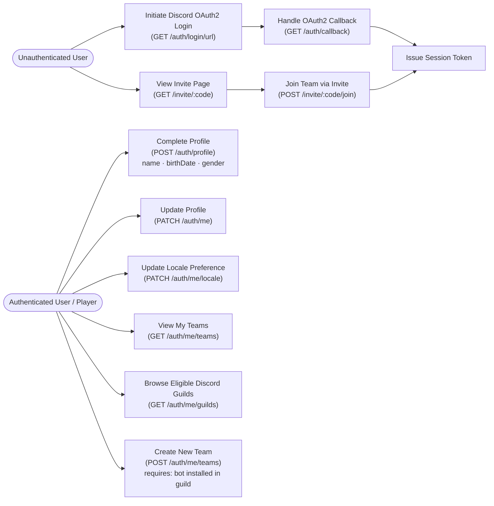

### 3.2 Team Management

Team management covers member lifecycle, roster organisation, and team-level configuration. Viewing members and rosters requires `roster:view`; editing member details requires `member:edit`; removing a member requires `member:remove`; roster creation and modification require `roster:manage`.

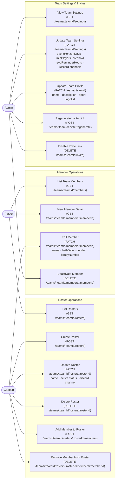

### 3.3 Roles & Permissions

Roles are team-scoped and carry a set of permissions. Four built-in roles (Admin, Captain, Player, Treasurer) exist for every team and cannot be deleted or renamed. Custom roles can be created by users with the `role:manage` permission.

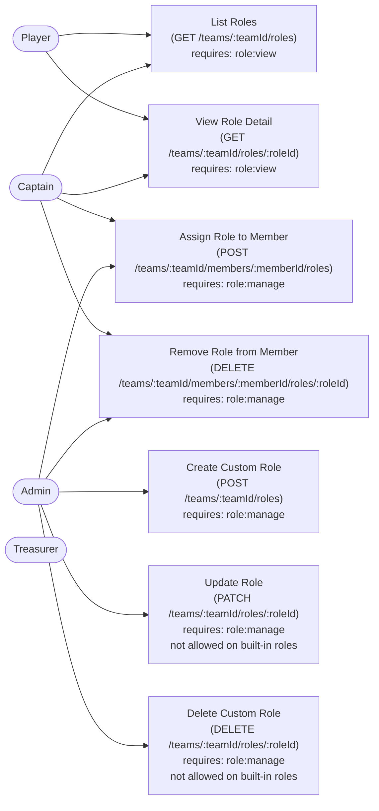

### 3.4 Groups

Groups organise team members into named sub-collections (e.g., age categories, playing lines). Groups can be nested via a parent reference. Each group can be mapped to a Discord channel, which causes the bot to synchronise channel access for group members. Groups also gate access to specific event types when used as owner or member groups on events or training types. Age threshold rules automatically move members between groups based on birth date.

```mermaid
flowchart LR
    AD(["Admin"])

    subgraph CRUD["Group CRUD"]
        UC_LIST_GROUPS["List Groups\n(GET /teams/:teamId/groups)"]
        UC_GET_GROUP["View Group Detail\n(GET /teams/:teamId/groups/:groupId)"]
        UC_CREATE_GROUP["Create Group\n(POST /teams/:teamId/groups)\nname · emoji · parentId"]
        UC_UPDATE_GROUP["Update Group\n(PATCH /teams/:teamId/groups/:groupId)"]
        UC_DELETE_GROUP["Delete Group\n(DELETE /teams/:teamId/groups/:groupId)"]
        UC_MOVE_GROUP["Move Group (re-parent)\n(PATCH /teams/:teamId/groups/:groupId/parent)"]
    end

    subgraph MEMBERSHIP["Group Membership"]
        UC_ADD_MEMBER["Add Member to Group\n(POST /teams/:teamId/groups/:groupId/members)"]
        UC_REMOVE_MEMBER["Remove Member from Group\n(DELETE /teams/:teamId/groups/:groupId/members/:memberId)"]
        UC_ASSIGN_ROLE["Assign Role to Group\n(POST /teams/:teamId/groups/:groupId/roles)"]
        UC_UNASSIGN_ROLE["Remove Role from Group\n(DELETE /teams/:teamId/groups/:groupId/roles/:roleId)"]
    end

    subgraph DISCORD["Discord Channel Mapping"]
        UC_GET_MAPPING["Get Channel Mapping\n(GET /teams/:teamId/groups/:groupId/channel-mapping)"]
        UC_SET_MAPPING["Set Channel Mapping\n(PUT /teams/:teamId/groups/:groupId/channel-mapping)"]
        UC_DELETE_MAPPING["Remove Channel Mapping\n(DELETE /teams/:teamId/groups/:groupId/channel-mapping)"]
        UC_CREATE_CHANNEL["Create Discord Channel for Group\n(POST /teams/:teamId/groups/:groupId/create-channel)"]
        UC_LIST_DC_CHANNELS["List Available Discord Channels\n(GET /teams/:teamId/discord-channels)"]
    end

    subgraph AGE["Age Threshold Rules"]
        UC_LIST_AGE["List Age Threshold Rules\n(GET /teams/:teamId/age-thresholds)"]
        UC_CREATE_AGE["Create Age Threshold Rule\n(POST /teams/:teamId/age-thresholds)\ngroupId · minAge · maxAge"]
        UC_UPDATE_AGE["Update Age Threshold Rule\n(PATCH /teams/:teamId/age-thresholds/:ruleId)"]
        UC_DELETE_AGE["Delete Age Threshold Rule\n(DELETE /teams/:teamId/age-thresholds/:ruleId)"]
        UC_EVALUATE_AGE["Evaluate Age Thresholds Now\n(POST /teams/:teamId/age-thresholds/evaluate)"]
    end

    AD --> UC_LIST_GROUPS
    AD --> UC_GET_GROUP
    AD --> UC_CREATE_GROUP
    AD --> UC_UPDATE_GROUP
    AD --> UC_DELETE_GROUP
    AD --> UC_MOVE_GROUP
    AD --> UC_ADD_MEMBER
    AD --> UC_REMOVE_MEMBER
    AD --> UC_ASSIGN_ROLE
    AD --> UC_UNASSIGN_ROLE
    AD --> UC_GET_MAPPING
    AD --> UC_SET_MAPPING
    AD --> UC_DELETE_MAPPING
    AD --> UC_CREATE_CHANNEL
    AD --> UC_LIST_DC_CHANNELS
    AD --> UC_LIST_AGE
    AD --> UC_CREATE_AGE
    AD --> UC_UPDATE_AGE
    AD --> UC_DELETE_AGE
    AD --> UC_EVALUATE_AGE
```

### 3.5 Events & RSVP

Events represent scheduled team activities (training, match, tournament, meeting, social, other). Events can be created as one-off occurrences or as part of a recurring series. A series definition specifies recurrence frequency and days of the week; individual events are generated from series by the background scheduler. RSVP responses are yes/no/maybe with an optional free-text message.

```mermaid
flowchart LR
    PL(["Player"])
    CP(["Captain"])
    SYS(["System (Cron)"])

    subgraph SINGLE["Single Events"]
        UC_LIST_EVENTS["List Events\n(GET /teams/:teamId/events)"]
        UC_GET_EVENT["View Event Detail\n(GET /teams/:teamId/events/:eventId)"]
        UC_CREATE_EVENT["Create Event\n(POST /teams/:teamId/events)\nrequires: event:create\ntitle · type · startAt · endAt\nlocation · trainingTypeId\ndiscordChannelId · ownerGroupId · memberGroupId"]
        UC_EDIT_EVENT["Edit Event\n(PATCH /teams/:teamId/events/:eventId)\nrequires: event:edit"]
        UC_CANCEL_EVENT["Cancel Event\n(POST /teams/:teamId/events/:eventId/cancel)\nrequires: event:cancel"]
        UC_START_EVENT["Mark Event as Started\n(background scheduler)\ntransitions status: active → started\nremoves RSVP buttons in Discord"]
    end

    subgraph SERIES["Event Series (Recurring)"]
        UC_LIST_SERIES["List Event Series\n(GET /teams/:teamId/event-series)"]
        UC_GET_SERIES["View Series Detail\n(GET /teams/:teamId/event-series/:seriesId)"]
        UC_CREATE_SERIES["Create Event Series\n(POST /teams/:teamId/event-series)\nrequires: event:create\nfrequency · daysOfWeek · startDate · endDate\nstartTime · endTime · location"]
        UC_EDIT_SERIES["Edit Event Series\n(PATCH /teams/:teamId/event-series/:seriesId)\nrequires: event:edit"]
        UC_CANCEL_SERIES["Cancel Event Series\n(POST /teams/:teamId/event-series/:seriesId/cancel)\nrequires: event:cancel"]
        UC_GEN_EVENTS["Generate Events from Series\n(background scheduler)"]
    end

    subgraph RSVP["RSVP"]
        UC_GET_RSVPS["View RSVP List\n(GET /teams/:teamId/events/:eventId/rsvps)"]
        UC_SUBMIT_RSVP["Submit RSVP\n(PUT /teams/:teamId/events/:eventId/rsvp)\nresponse: yes / no / maybe\noptional message"]
        UC_NON_RESPONDERS["View Non-Responders\n(GET /teams/:teamId/events/:eventId/rsvps/non-responders)"]
        UC_RSVP_REMINDER["Send RSVP Reminder Notification\n(background scheduler)"]
    end

    PL --> UC_LIST_EVENTS
    PL --> UC_GET_EVENT
    PL --> UC_SUBMIT_RSVP
    PL --> UC_GET_RSVPS
    PL --> UC_LIST_SERIES
    PL --> UC_GET_SERIES

    CP --> UC_CREATE_EVENT
    CP --> UC_EDIT_EVENT
    CP --> UC_CANCEL_EVENT
    CP --> UC_CREATE_SERIES
    CP --> UC_EDIT_SERIES
    CP --> UC_CANCEL_SERIES
    CP --> UC_NON_RESPONDERS

    SYS --> UC_GEN_EVENTS
    SYS --> UC_START_EVENT
    SYS --> UC_RSVP_REMINDER
```

### 3.6 Activity Tracking

Activity tracking records physical activities for individual members. Each log entry is associated with an activity type (identified by a slug such as `gym`, `running`) and an optional duration in minutes. The leaderboard ranks members by total activity count, total duration, and streak metrics over a configurable time frame. Admins can define custom team-specific activity types in addition to the four global built-ins; the bot can auto-log attendance as activities after events conclude.

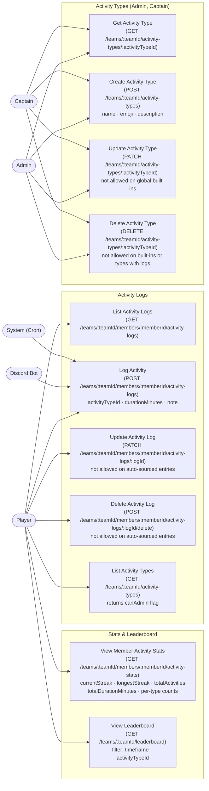

### 3.7 Calendar Subscription (iCal)

Each authenticated user can obtain a personal iCal feed URL secured by a private token. The feed returns all upcoming events across all of the user's teams in standard iCalendar format, enabling subscription in any calendar application. The token can be regenerated to revoke access to the old URL.

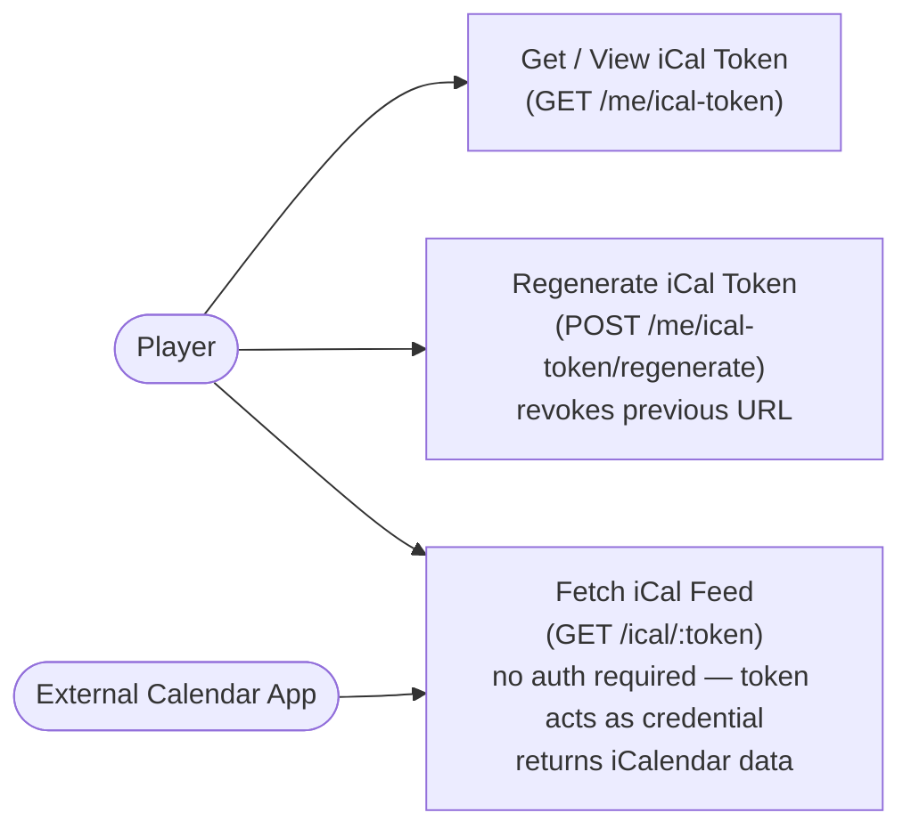

### 3.8 Discord Bot Commands & Interactions

The Discord bot exposes slash commands within a Discord guild. Commands that require team membership are scoped to the guild; the bot resolves the guild to a Sideline team via an internal mapping. RSVP and pagination interactions are driven by message component buttons posted on event embeds.

```mermaid
flowchart LR
    DU(["Discord User"])
    BOT(["Discord Bot"])
    SYS(["System (Event/Role Sync Worker)"])

    subgraph SLASH["Slash Commands"]
        UC_EVT_LIST["\/event list\nShows per-user upcoming events\none event per page · ephemeral · own RSVP visible\n(Event/GetUpcomingEventsForUser)"]
        UC_EVT_OVERVIEW["\/event overview\nPosts a persistent overview button in the channel\nrequires Manage Server permission"]
        UC_EVT_CREATE["\/event create\nCreates a new event for the team\nrequires event:create permission"]
        UC_INFO["\/info\nShows bot and server version information\nephemeral embed · no permission required"]
        UC_MAK_LOG["\/makanicko log\nLogs an activity for the invoking user\nactivity type · optional duration · optional note"]
        UC_MAK_STATS["\/makanicko stats\nDisplays personal activity stats and streak"]
        UC_MAK_LB["\/makanicko leaderboard\nDisplays top-10 leaderboard embed\nshows requesting user's own rank in footer"]
    end

    subgraph BUTTONS["Button Interactions on Embeds"]
        UC_BTN_RSVP["RSVP Button (Yes / No / Maybe)\nSaves RSVP immediately on click (no modal)\nEphemeral confirm with Add/Edit/Clear message buttons\nupdates embed counts in real time"]
        UC_BTN_PAGE["Upcoming Events Navigation Buttons\nNavigates upcoming events one event at a time"]
        UC_BTN_OVERVIEW_SHOW["Overview Show Button\nOpens ephemeral upcoming events embed for the clicking user\n(Event/GetUpcomingEventsForUser)"]
    end

    subgraph SYNC["Background Sync (RPC)"]
        UC_SYNC_ROLES["Sync Discord Roles\nApplies / removes Discord guild roles\nwhen Sideline role assignments change\n(Role/GetUnprocessedEvents → Role/MarkEventProcessed)"]
        UC_SYNC_CHANNELS["Sync Discord Channels\nCreates / updates channel permissions\nwhen group channel mappings change\n(Channel RPC group)"]
        UC_POST_EMBED["Post Event Embed\nPosts or updates an event embed message\nin the configured Discord channel\nwhen an event is created or updated\n(Event/GetUnprocessedEvents → Event/MarkEventProcessed)"]
    end

    DU --> UC_EVT_LIST
    DU --> UC_EVT_OVERVIEW
    DU --> UC_EVT_CREATE
    DU --> UC_INFO
    DU --> UC_MAK_LOG
    DU --> UC_MAK_STATS
    DU --> UC_MAK_LB
    DU --> UC_BTN_RSVP
    DU --> UC_BTN_PAGE
    DU --> UC_BTN_OVERVIEW_SHOW

    BOT --> UC_EVT_LIST
    BOT --> UC_EVT_OVERVIEW
    BOT --> UC_EVT_CREATE
    BOT --> UC_INFO
    BOT --> UC_MAK_LOG
    BOT --> UC_MAK_STATS
    BOT --> UC_MAK_LB
    BOT --> UC_BTN_RSVP
    BOT --> UC_BTN_PAGE
    BOT --> UC_BTN_OVERVIEW_SHOW
    BOT --> UC_SYNC_ROLES
    BOT --> UC_SYNC_CHANNELS
    BOT --> UC_POST_EMBED

    SYS --> UC_SYNC_ROLES
    SYS --> UC_SYNC_CHANNELS
    SYS --> UC_POST_EMBED
```

### 3.9 Weekly Challenges

Weekly challenges give captains a structured way to set a recurring physical or skill goal for the team. Captains create a challenge for a specific ISO week (Monday–Sunday); members mark their own completion during that week. The bot posts a challenge embed on Monday morning to a configured Discord channel.

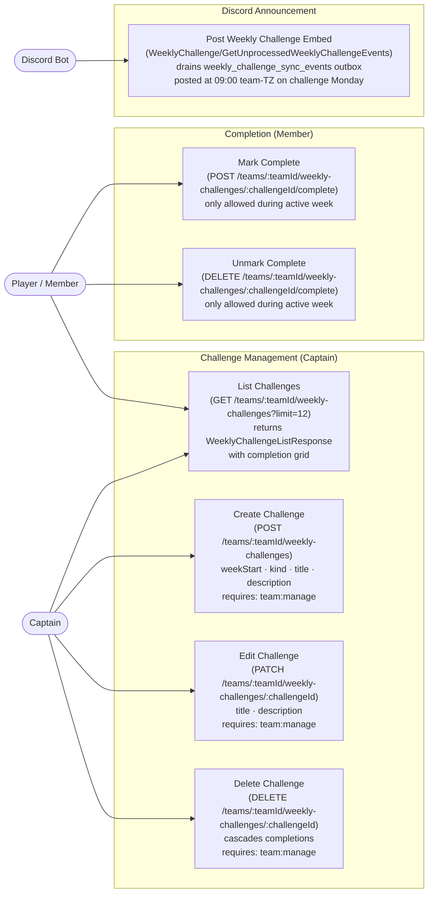

### 3.10 Dashboard Layout Customisation

Each team member can personalise their team dashboard by reordering and showing or hiding the four available widgets (`stats`, `upcomingEvents`, `activity`, `teamManagement`). The layout is stored per user per team; other members are not affected. Pinned banners (e.g. outstanding payments) always render above the configurable region regardless of widget settings.

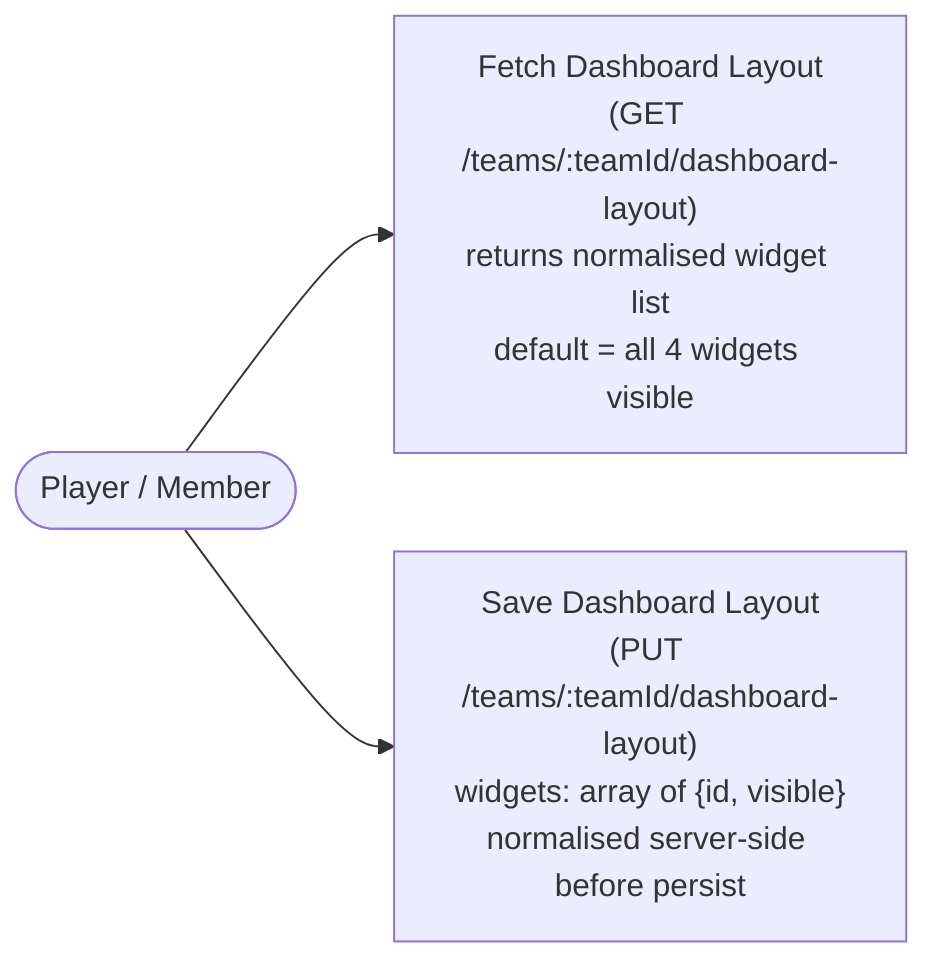

---

## 4. Use Case Descriptions

The following structured descriptions cover the most significant use cases in the system.

---

### UC-01: Login via Discord OAuth2

| Field | Detail |
|---|---|
| **Actor** | Unauthenticated User |
| **Precondition** | The user has a Discord account and a web browser. |
| **Main Flow** | 1. User navigates to the Sideline web application. 2. The application redirects the user to the Discord OAuth2 authorisation endpoint (`GET /auth/login/url`). 3. The user approves the authorisation request on Discord. 4. Discord redirects the user's browser to the callback endpoint (`GET /auth/callback`) with an authorisation code. 5. The server exchanges the code for a Discord access token, retrieves the user's Discord profile, and upserts a Sideline user record. 6. The server issues a session bearer token and redirects the browser to the application. |
| **Postcondition** | The user is authenticated. If their profile is incomplete, they are directed to the profile completion page. |

---

### UC-02: Accept Team Invite

| Field | Detail |
|---|---|
| **Actor** | Unauthenticated User, Authenticated User |
| **Precondition** | A valid invite link with an active code exists. |
| **Main Flow** | 1. The user opens the invite URL (e.g., `https://sideline.app/invite/ABC123`). 2. The application calls `GET /invite/:code` to fetch the team name and validate the code. 3. If the user is not authenticated, they are redirected to log in (UC-01) and then returned to this flow. 4. The user confirms joining the team. 5. The application calls `POST /invite/:code/join`, which creates a team membership with the default Player role. 6. If the user's profile is incomplete, they are redirected to complete it. |
| **Postcondition** | The user is a member of the team with the Player role. |
| **Alternate Flow** | If the user is already a member, the API returns `409 AlreadyMember` and the UI shows an appropriate message. |

---

### UC-03: Create Event

| Field | Detail |
|---|---|
| **Actor** | Captain, Admin |
| **Precondition** | The actor is authenticated and holds the `event:create` permission on the target team. |
| **Main Flow** | 1. The actor navigates to the Events section and selects "Create Event". 2. The actor fills in the event title, type (training / match / tournament / meeting / social / other), start date/time, and optional fields (end time, location, description, training type, owner group, member group, Discord channel). 3. The application calls `POST /teams/:teamId/events` with the payload. 4. The server validates the request, persists the event, and enqueues an event sync job. 5. The background sync worker picks up the job and posts an embed message to the configured Discord channel via the Discord bot. |
| **Postcondition** | A new event exists in the database. An embed message is posted in the designated Discord channel. |
| **Alternate Flow** | If the actor chooses "Create Series", they fill in recurrence settings (frequency, days of week, start date, end date, start/end time) and the server creates an event series record. Background jobs generate individual event occurrences within the event horizon window. |

---

### UC-04: Submit RSVP

| Field | Detail |
|---|---|
| **Actor** | Player (web); Discord User (via bot button) |
| **Precondition** | The event exists and has not been cancelled. The RSVP deadline has not passed. The actor is a member of the team (or, if the event has a member group, is a member of that group). |
| **Main Flow** | 1. The actor opens the event detail page (web) or sees the event embed in Discord. 2. The actor clicks a response button: Yes, No, or Maybe. 3. Both the web app and the Discord bot immediately call the RSVP endpoint on click (no separate confirmation step). **Web:** calls `PUT /teams/:teamId/events/:eventId/rsvp` with the selected response and the actor's existing message (if any). **Discord bot:** calls `Event/SubmitRsvp` via RPC; the bot replies with an ephemeral confirmation. 4. The server records the response and returns updated counts. 5. The bot updates the RSVP count display on the Discord embed. 6. **Web (optional note):** After a response is recorded, the actor can type a note and click "Save note", which triggers a second `PUT /teams/:teamId/events/:eventId/rsvp` call carrying the updated message. **Discord bot (optional message):** The ephemeral confirmation includes a `[💬 Add a message]` button. Clicking it opens a modal where the actor can type an optional message; submitting saves the message via a second `Event/SubmitRsvp` call. If a message already exists the buttons shown are `[💬 Edit message]` and `[🗑️ Clear message]`. |
| **Postcondition** | The actor's RSVP response is recorded. The Discord embed shows up-to-date attendance counts. |
| **Alternate Flow** | If the RSVP deadline has passed the API returns `400 RsvpDeadlinePassed` and the UI informs the user. |

---

### UC-05: Log Activity (Web)

| Field | Detail |
|---|---|
| **Actor** | Player |
| **Precondition** | The actor is an active team member. |
| **Main Flow** | 1. The actor navigates to the Makanicko (activity tracking) page. 2. The actor selects an activity type from the available list. 3. The actor optionally specifies duration in minutes (1–1440) and a text note. 4. The application calls `POST /teams/:teamId/members/:memberId/activity-logs`. 5. The server persists the log entry with `source: manual`. |
| **Postcondition** | A new activity log entry exists. The actor's streak and statistics are updated. |

---

### UC-06: Log Activity via Discord Bot

| Field | Detail |
|---|---|
| **Actor** | Discord User |
| **Precondition** | The user is an active Sideline team member in the guild. |
| **Main Flow** | 1. The user runs `/makanicko log activity:<type> [duration:<minutes>] [note:<text>]` in a Discord channel. 2. The bot immediately returns an ephemeral "thinking" message. 3. The bot calls `Activity/LogActivity` via RPC with the user's Discord ID, guild ID, and provided parameters. 4. The server resolves the guild to a team, finds the matching member, and creates an activity log entry. 5. The bot edits the ephemeral message with a success confirmation including the activity type. |
| **Postcondition** | A new activity log entry exists with `source: manual`. |
| **Alternate Flow** | If the user is not a Sideline team member in that guild, the bot responds with "not a member" message. |

---

### UC-07: Manage Role Assignments

| Field | Detail |
|---|---|
| **Actor** | Admin, Captain (limited) |
| **Precondition** | The actor holds `role:manage` permission. The target member is an active team member. |
| **Main Flow** | 1. The actor navigates to the Roles section or the member's detail page. 2. The actor selects a role to assign to a member. 3. The application calls `POST /teams/:teamId/members/:memberId/roles` with the chosen `roleId`. 4. The server persists the assignment and enqueues a role sync event. 5. The Discord bot sync worker calls `Role/GetUnprocessedEvents`, processes the event by updating the member's Discord guild role, and calls `Role/MarkEventProcessed`. |
| **Postcondition** | The member holds the assigned role. The member's Discord guild role is updated to reflect the new assignment. |

---

### UC-08: Manage Age Threshold Rules

| Field | Detail |
|---|---|
| **Actor** | Admin; System (Cron) |
| **Precondition** | The actor holds `team:manage` permission. Target groups exist. |
| **Main Flow** | 1. Admin creates one or more age threshold rules (`POST /teams/:teamId/age-thresholds`) specifying a target group, minimum age, and/or maximum age. 2. At scheduled intervals the system evaluates the rules (`POST /teams/:teamId/age-thresholds/evaluate`). 3. The server computes each member's age from their birth date and determines which groups they should belong to. 4. Members who no longer meet a group's age criteria are removed; members who now qualify are added. 5. Group membership changes trigger Discord channel sync events for any groups with channel mappings. |
| **Postcondition** | Members are automatically placed in the correct age-based groups. Discord channel access reflects the updated group membership. |

---

### UC-09: Subscribe to iCal Feed

| Field | Detail |
|---|---|
| **Actor** | Player; External Calendar Application |
| **Precondition** | The actor is authenticated. |
| **Main Flow** | 1. The actor navigates to the Calendar Subscription settings page. 2. The application calls `GET /me/ical-token` to retrieve the current token and feed URL. 3. The actor copies the URL and adds it as a calendar subscription in their calendar application. 4. The calendar application periodically fetches `GET /ical/:token`, which returns (a) team event VEVENTs across all of the user's teams and (b) all-day payment VEVENTs for unpaid or overdue fee assignments (capped to the past 180 days), each with a VALARM that fires one day before the due date. |
| **Postcondition** | The external calendar application displays all team events and upcoming payment due dates, keeping both up to date. |
| **Alternate Flow** | The actor can call `POST /me/ical-token/regenerate` to rotate the token (e.g., if the URL was shared accidentally), which renders the previous URL invalid. |

---

### UC-10: Post Event Embed to Discord

| Field | Detail |
|---|---|
| **Actor** | Discord Bot; System (Event Sync Worker) |
| **Precondition** | An event has been created or updated and has a Discord channel configured. The bot is a member of the relevant guild. |
| **Main Flow** | 1. When an event is created or updated the server writes an event sync record to the database. 2. The bot's event sync worker polls `Event/GetUnprocessedEvents`. 3. For each pending event the worker calls `Event/GetEventEmbedInfo` to fetch the event details and current RSVP counts. 4. The worker uses the Discord REST API to post (or edit) a message in the configured channel containing a rich embed with event details and RSVP Yes/No/Maybe buttons. 5. The worker stores the resulting Discord message ID via `Event/SaveDiscordMessageId` and marks the event as processed via `Event/MarkEventProcessed`. |
| **Postcondition** | An up-to-date event embed with interactive RSVP buttons is visible in the designated Discord channel. |

---

### UC-11: Manage Translation Overrides

| Field | Detail |
|---|---|
| **Actor** | Global Admin |
| **Precondition** | The actor's Discord ID is listed in `APP_GLOBAL_ADMIN_DISCORD_IDS`. The actor is authenticated. |
| **Main Flow** | 1. The actor navigates to `/admin/translations` in the web app. 2. The page loads all translation keys from the compiled message registry and fetches current overrides via `GET /api/translations`. 3. The actor searches for a key by name and edits the EN or CS override value inline. 4. On blur (or pressing Enter) the web app calls `PATCH /api/translations/:key` with the new value. The server upserts the override row and bumps the cache version. 5. Alternatively, the actor uploads a JSON file (locale-keyed object or flat array) via the Import dialog; the web app calls `POST /api/translations/import`. The server validates all keys against the compiled registry, rejects unknown keys with a `400 UnknownTranslationKeys` error listing the bad keys, and on success upserts all valid overrides. 6. The actor can delete an individual override by clicking the delete button next to it; the web app calls `PATCH /api/translations/:key` with `null` for the locale, which removes the row and restores the compiled default. 7. The actor can download a full locale-keyed JSON bundle (compiled defaults merged with all active overrides) via the Export button, which opens `GET /api/translations/export.json`. |
| **Postcondition** | The `translation_overrides` table reflects the actor's changes. The `translation_cache_version` counter is incremented. All authenticated clients that call `GET /api/translations` subsequently receive the updated overrides. |
| **Notes** | Keys whose names begin with `bot_` are used by the Discord bot. Overrides to such keys take effect only after the bot process is redeployed, because the bot loads its string table at startup from the compiled registry. An override value of `""` (empty string) suppresses the compiled default and renders nothing; this is intentional and distinct from deleting the override. |

---

### UC-12: Create and Assign a Fee (Treasurer/Admin)

| Field | Detail |
|---|---|
| **Actor** | Treasurer; Admin |
| **Precondition** | The actor is authenticated and holds `finance:manage_fees` permission. |
| **Main Flow** | 1. The actor navigates to **Team → Finances → Fees** (`/teams/:teamId/finances/fees`) and clicks **Create fee**. 2. The fee form dialog collects name, amount, currency, optional due date, and target scope; on submit the web app calls `POST /teams/:teamId/fees`. 3. The server creates a `fees` row and returns a `FeeView`. 4. The actor selects members to assign from the fee management page; the web app calls `POST /teams/:teamId/fees/:feeId/assignments` with the chosen member IDs and any per-member overrides. 5. The server inserts one `fee_assignments` row per member and returns `FeeAssignmentView[]`. |
| **Postcondition** | Each target member has an assignment with status `pending`. |
| **Alternate Flow** | If the fee's `target_scope` is `'all_members'`, the actor can assign all current team members in a single call. Actors with scripted workflows can also invoke the API directly (same endpoints). |
| **Notes** | v1 only supports `recurrence = 'none'`. Auto-monthly recurrence is planned for a future release. |

---

### UC-13: Record a Payment (Treasurer/Admin)

| Field | Detail |
|---|---|
| **Actor** | Treasurer; Admin |
| **Precondition** | The actor holds `finance:record_payments`. A fee assignment exists for the member. |
| **Main Flow** | 1. The actor calls `POST /teams/:teamId/fees/:feeId/assignments/:assignmentId/payments` with `amountMinor`, `method` (`cash` or `bank_transfer`), `paidAt`, and optional `note`. 2. The server inserts a `payments` row. 3. The database trigger `payments_recompute_paid_minor` immediately updates `fee_assignments.paid_minor`. 4. If `paid_minor >= amount_minor` the assignment status transitions to `paid`; otherwise to `partial`. |
| **Postcondition** | The payment is recorded. The assignment's status reflects the new payment total. |
| **Alternate Flow** | If a payment was recorded in error, the actor calls `DELETE /teams/:teamId/payments/:paymentId` with a `reason`. The payment is voided (not deleted) and the trigger recomputes `paid_minor`, potentially reverting the status from `paid` to `partial` or `pending`. |

---

### UC-14: Check Finance Status via Discord (Member)

| Field | Detail |
|---|---|
| **Actor** | Any Discord user who is a Sideline team member |
| **Precondition** | The user is in a Discord guild linked to a Sideline team. |
| **Main Flow** | 1. The user invokes `/finance status` in any Discord channel where the bot has permission. 2. The bot sends a deferred ephemeral acknowledgement and calls `Finance/GetMyStatus` RPC with the guild and user IDs. 3. The server locates the team by guild ID, finds the team member by Discord user ID, and returns all fee assignments grouped by currency. 4. The bot builds a rich embed coloured green (all clear), amber (pending/partial), or red (overdue) and updates the deferred message with it. |
| **Postcondition** | The invoking user sees their outstanding fees in an ephemeral embed visible only to them. |
| **Alternate Flow** | If the guild is not linked to a Sideline team (`FinanceGuildNotFound`), the bot silently returns the all-clear embed. If the user is not a team member (`FinanceMemberNotFound`), the bot responds with a "not a member" message. |

---

### UC-15: View Version Information via Discord

| Field | Detail |
|---|---|
| **Actor** | Any Discord user |
| **Precondition** | The bot is installed in the Discord server. |
| **Main Flow** | 1. The user invokes `/info` in any channel where the bot has permission to reply. 2. The bot calls `BotInfo/GetServerVersion` RPC to retrieve the server's running version. If the RPC call fails, the server version falls back to `"unknown"`. 3. The bot replies with an ephemeral embed displaying the bot version, the server version, and an author credit link. |
| **Postcondition** | The invoking user sees the current bot and server version strings in an ephemeral message visible only to them. |
| **Alternate Flow** | If the RPC call to retrieve the server version fails, the embed still displays, with `"unknown"` shown in the server version field. |

---

### UC-16: View Own Payment History (Member)

| Field | Detail |
|---|---|
| **Actor** | Any authenticated team member (Player, Captain, Treasurer, Admin) |
| **Precondition** | The actor is authenticated and is a member of the team. No additional permission is required. |
| **Main Flow** | 1. The actor navigates to **Team → My Payments** (`/teams/:teamId/my-payments`). The page loads via `GET /teams/:teamId/finance/my-status` (assignments) and on row expand via `GET /teams/:teamId/finance/my-payments?feeId=…` (payment records). 2. The page displays four KPI cards: outstanding balance, overdue count, total paid, and next due date. 3. The actor optionally filters by status (All / Outstanding / Paid / Waived). 4. The actor clicks the chevron on a row to expand the inline payment history for that assignment, showing each payment's amount, method, date, and recorder. |
| **Postcondition** | The actor sees only their own fee assignments and payment records. No cross-member reads are possible. |
| **Alternate Flow** | If the actor has no assignments, the page shows an empty-state message. If the dashboard detects outstanding or overdue fees, a banner with a link to the My Payments page appears on the Team Dashboard. |

---

### UC-17: Receive Payment Reminder DM (Member)

| Field | Detail |
|---|---|
| **Actor** | Any Discord user who is a Sideline team member with an unpaid or overdue fee assignment |
| **Precondition** | The user has a Discord account linked to their Sideline profile. A fee assignment exists with a due date. The bot is connected and the server is running. |
| **Main Flow** | 1. The server's `PaymentReminderCron` runs every minute. It queries `fee_assignments` (using `idx_fee_assignments_due_at`) for assignments whose due date places them at one of five cadence thresholds: T−3 days (`due_in_3d`), T+0 (`due_today`), T+3 (`overdue_3d`), T+10 (`overdue_10d`), or T+21 (`overdue_21d`). 2. For each candidate that does not already have an unprocessed outbox row of the same kind, the cron inserts a row into `payment_reminder_sync_events`. 3. The bot's Finance Sync worker polls `Finance/GetUnprocessedPaymentReminders` (5-second cadence). 4. For each event the bot opens a DM channel with the member via the Discord REST API and posts a rich embed showing the fee name, total amount, outstanding balance, and due date. The embed colour indicates urgency (blue = soon, yellow = due today, red = overdue). 5. On successful delivery the bot calls `Finance/MarkReminderSent` to insert a row into `payment_reminders_sent` (`PRIMARY KEY (assignment_id, kind)`), then calls `Finance/MarkPaymentReminderProcessed`. |
| **Postcondition** | The member receives a DM. The `payment_reminders_sent` row prevents a repeat DM for the same assignment and cadence, even if the cron fires again or the bot restarts. |
| **Alternate Flow** | If the Discord DM API call fails (e.g. the user has DMs disabled from non-friends), the bot calls `Finance/MarkPaymentReminderFailed`. The outbox row is marked `processed_at = now()` (permanent failure — no retry). The member does not receive that cadence's reminder. |
| **Notes** | Reminders are silenced automatically once the assignment is paid or waived: the cron's candidate query filters on `computed_status NOT IN ('paid', 'waived')`. |

---

### UC-18: Create / Update / Delete a Team Expense (Treasurer/Admin)

| Field | Detail |
|---|---|
| **Actor** | Treasurer or Admin |
| **Precondition** | The actor is authenticated and holds `finance:manage_fees` permission. |
| **Main Flow** | 1. The actor navigates to **Team → Finances → Expenses** (`/teams/:teamId/finances/expenses`) and clicks **Add expense**. 2. The expense form dialog collects category (fields, equipment, travel, tournaments, or other), amount, currency, date, and description; on submit the web app calls `POST /teams/:teamId/expenses`. 3. The server validates `amountMinor > 0` and inserts an `expenses` row; the `expenses_audit` trigger writes an `insert` row to `expense_history`. 4. The expense appears in the list on the Expenses page and is reflected immediately in the balance summary. 5. To edit, the actor clicks the expense row and modifies any field via `PATCH /teams/:teamId/expenses/:expenseId`. 6. To delete, the actor removes the record via `DELETE /teams/:teamId/expenses/:expenseId`; the trigger writes a `delete` snapshot to `expense_history` before the row is removed. |
| **Postcondition** | The expense is stored (or updated/removed) and the `expense_history` audit log reflects the operation. The balance summary is recalculated on the next query. |
| **Alternate Flow** | If `amountMinor ≤ 0` the server returns `400 InvalidExpenseAmount`. If `currency` is supplied without `amountMinor` on a PATCH, the server also returns `400 InvalidExpenseAmount`. |
| **Notes** | Expenses are hard-deleted (no soft-archive). Historical context is preserved entirely through `expense_history`. |

---

### UC-19: View Balance Summary (Treasurer/Admin/Captain)

| Field | Detail |
|---|---|
| **Actor** | Treasurer, Admin, or Captain (any member holding `finance:view`) |
| **Precondition** | The actor is authenticated and holds `finance:view` permission. |
| **Main Flow** | 1. The actor navigates to **Team → Finances** (`/teams/:teamId/finances`). The page loads with the **Overview** tab active by default. 2. The web app calls `GET /teams/:teamId/finances/balance-summary` (optionally with `from`/`to` query parameters). 3. The server aggregates total income (sum of non-voided payments) and total expenses (sum of expense `amount_minor`) per currency and returns a `BalanceSummary[]` array. 4. The page displays Income, Expenses, and Net balance KPI tiles per currency. |
| **Postcondition** | The actor sees a per-currency breakdown of total income, total expenses, and the resulting net balance for the team. |
| **Alternate Flow** | If the actor applies a date range filter, only payments and expenses within that range are included in the summary. |

---

### UC-20: Global Admin Onboards a New Team (Mint Token)

| Field | Detail |
|---|---|
| **Actor** | Global Admin |
| **Precondition** | The global admin is authenticated. Their Discord ID is listed in `APP_GLOBAL_ADMIN_DISCORD_IDS`. They have the Discord user ID of the intended captain. |
| **Main Flow** | 1. The global admin navigates to **Administration → Team onboarding** in the web app. 2. The admin fills in the **Create onboarding link** form: proposed team name, captain's Discord user ID, and TTL (`24h`, `72h`, or `7d`). 3. On submit the web app calls `POST /auth/onboarding/tokens`. 4. The server verifies the caller is a global admin, inserts a `team_onboarding_tokens` row (storing only the SHA-256 hash of the generated token) with `expires_at = now() + ttl`, and returns the plaintext token and full URL. 5. The URL is displayed once only; the admin copies it and sends it to the captain over Discord. 6. The **Existing tokens** list (via `GET /auth/onboarding/tokens`) shows the new token as **Active** alongside any earlier tokens and their statuses. 7. If the admin wishes to cancel an unused link they click **Revoke** next to its row; the web app calls `DELETE /auth/onboarding/tokens/:tokenId`, setting `revoked_at = now()`. |
| **Postcondition** | A single-use `team_onboarding_tokens` row exists with `consumed_at`, `revoked_at` both null and `expires_at` in the future. Only the designated captain's Discord account can use the link. The plaintext token is not stored by the server after creation. |
| **Alternate Flow** | The revoke endpoint silently no-ops if the token is already revoked (the UPDATE WHERE clause requires `revoked_at IS NULL`). |
| **Notes** | This use case replaces the self-service `POST /auth/create-team` flow for new teams that need to be bootstrapped externally. The `createTeam` page shows a banner directing would-be new teams to request an onboarding link instead. |

---

### UC-21: Captain Completes Team Onboarding Wizard

| Field | Detail |
|---|---|
| **Actor** | Unauthenticated User (prospective captain who received an onboarding link) |
| **Precondition** | The global admin has minted an active, non-expired token bound to the captain's Discord ID (see UC-20). The captain has not previously completed the wizard with this token. |
| **Main Flow** | 1. The captain opens the onboarding URL (`/onboarding/:plaintextToken`) in a browser. 2. The web app calls `GET /auth/onboarding/tokens/:plaintextToken/preview` (no auth required). The server hashes the plaintext token, looks up the row, and returns `proposedName`, `boundDiscordId`, and `expiresAt`. 3. The page shows a "Sign in to claim {proposedName}" CTA. The captain authenticates via Discord OAuth (diagram 1). 4. After login the web app redirects back to `/onboarding/:plaintextToken`. Step 1 of the wizard is shown — **Team identity** (name, description, sport, logo URL). The name is pre-filled from `proposedName`. 5. The captain fills in step 1 and clicks **Next**. Step 2 is shown — **Discord setup** (guild picker, welcome channel, system log channel, onboardingLocale). 6. The captain completes step 2 and clicks **Create team**. The web app calls `POST /auth/onboarding/tokens/:plaintextToken/complete` with the combined form payload. 7. The server verifies the token is still active and unexpired, checks `authenticated_user.discord_id = token.bound_discord_id`, checks the selected `guild_id` is not already claimed by another team, then inside a single database transaction creates the team (all 16 columns), four built-in roles with their default permissions, and a team-member row for the captain with the Admin role, and atomically marks the token consumed (`consumed_at = now()`, `consumed_by`, `resulting_team_id`). 8. The server returns a `UserTeam` object. The web app redirects the captain to the team dashboard (`/teams/:teamId`). |
| **Postcondition** | A new team exists with the captain as its first Admin. The `team_onboarding_tokens` row has `consumed_at` set. The token URL is no longer usable. |
| **Alternate Flow A** | If the token is expired at step 2, the server returns `410 OnboardingTokenExpired`; the page shows an expiry error with instructions to contact the global admin. |
| **Alternate Flow B** | If the authenticated captain's Discord ID does not match `bound_discord_id`, the server returns `403 OnboardingWrongCaptain`; the page shows an error asking the captain to sign in with the correct Discord account. |
| **Alternate Flow C** | If the selected Discord guild is already linked to another Sideline team, the server returns `409 OnboardingGuildAlreadyClaimed`; the form shows an inline error on the guild picker. |
| **Notes** | The wizard is a two-step form rendered entirely client-side; no intermediate server calls are made between steps. The token is consumed atomically inside `sql.withTransaction` — a network failure or race is rolled back. |

---

### UC-22: Captain Creates / Edits / Deletes a Weekly Challenge

| Field | Detail |
|---|---|
| **Actor** | Captain (or any member holding `team:manage`) |
| **Precondition** | The actor is authenticated and holds `team:manage` permission on the target team. |
| **Main Flow — Create** | 1. The captain navigates to **Team → Weekly challenges** (`/teams/:teamId/challenges`). 2. The page loads via `GET /teams/:teamId/weekly-challenges?limit=12`. The response includes `canCreate: true` and the last 12 weeks of challenges with per-member completion data. 3. The captain clicks **Nová týdenní výzva** (New weekly challenge). 4. A form collects: week start date (Monday, ±1 week), kind (`throwing` or `sport`), title (max 120 chars), and optional description (max 2000 chars). 5. On submit the web app calls `POST /teams/:teamId/weekly-challenges`. 6. The server validates `weekStart` is a Monday within the allowed window, checks uniqueness on `(team_id, week_start_date)`, inserts the `weekly_challenges` row, and schedules a `weekly_challenge_sync_events` row for team-TZ 09:00 on the challenge's Monday. |
| **Main Flow — Edit** | The captain opens the challenge's edit form and changes the title and/or description. The web app calls `PATCH /teams/:teamId/weekly-challenges/:challengeId`. The week, kind, and completion records are unchanged. |
| **Main Flow — Delete** | The captain clicks **Smazat výzvu** and confirms. The web app calls `DELETE /teams/:teamId/weekly-challenges/:challengeId`. The server cascades to `weekly_challenge_completions` and to any pending `weekly_challenge_sync_events`. |
| **Postcondition — Create** | A new `weekly_challenges` row exists. A `weekly_challenge_sync_events` outbox row is scheduled so the bot will post the embed on Monday morning. |
| **Postcondition — Delete** | The challenge row, all completion records, and any undelivered sync events are removed. |
| **Alternate Flow** | If a challenge already exists for the chosen week, the API returns `409 WeeklyChallengeAlreadyExistsForWeek`. If the week is outside the ±1-week window, the API returns `422 WeeklyChallengeWeekOutOfRange`. |

---

### UC-23: Member Marks / Unmarks Weekly Challenge Complete

| Field | Detail |
|---|---|
| **Actor** | Player (any active team member) |
| **Precondition** | The actor is an active team member. A weekly challenge exists for the current ISO week (determined using the team's configured timezone). |
| **Main Flow** | 1. The member opens **Team → Weekly challenges** (`/teams/:teamId/challenges`). 2. The page displays the challenge grid: weeks as columns (newest left), members as rows. The active week's column is highlighted. 3. The member clicks the tick cell in the active week's column for their row. The web app calls `POST /teams/:teamId/weekly-challenges/:challengeId/complete`. 4. The server inserts a `weekly_challenge_completions` row for `(challenge_id, member_id)`. The cell updates to show the completed state (Splněno ✓). 5. To undo, the member clicks the tick again. The web app calls `DELETE /teams/:teamId/weekly-challenges/:challengeId/complete`. The completion row is removed. |
| **Postcondition** | The member's completion state for the current week is toggled. All other viewers of the challenges page see the updated grid on their next load. |
| **Alternate Flow** | If the challenge's week is not the current week (checked server-side using the team timezone), the API returns `409 WeeklyChallengeNotActive` and the UI shows an error. Tick cells for past and future weeks are rendered as read-only in the web UI. |

---

### UC-24: Customise Personal Team Dashboard

| Field | Detail |
|---|---|
| **Actor** | Player (any active team member) |
| **Precondition** | The actor is an authenticated, active member of the team. |
| **Main Flow** | 1. The actor navigates to the team dashboard (`/teams/:teamId`). The page loads via `GET /teams/:teamId/dashboard-layout` to determine widget order and visibility. If no row exists the server returns all four widgets visible in canonical order. 2. The actor opens the **Customise dashboard** panel. The panel lists the four widgets (`stats`, `upcomingEvents`, `activity`, `teamManagement`) with their current order and a visibility toggle for each. 3. The actor reorders widgets using the **Move up** / **Move down** controls and toggles visibility using the switches. 4. The actor clicks **Save**. The web app calls `PUT /teams/:teamId/dashboard-layout` with the updated `widgets` array. 5. The server normalises the payload (deduplicates, drops unknown IDs, appends missing widgets as visible), upserts the `dashboard_layouts` row, and returns the normalised layout. 6. The page calls `router.invalidate()` to refresh the dashboard with the updated layout. |
| **Postcondition** | The actor's `dashboard_layouts` row is upserted. On the next load the dashboard renders widgets in the saved order, hiding any that were toggled off. Other team members' layouts are unaffected. |
| **Notes** | Pinned banners (e.g. outstanding fee warnings) always render above the configurable widget region and are not affected by layout settings. The layout is per-user per-team — each member of the same team can have a different configuration. |
